# Family: sase-qy.4

[Agent Hoods](../README.md) / [bbugyi200](../users/bbugyi200/README.md) / [athena](../users/bbugyi200/machines/athena/README.md) / [sase-qy](../users/bbugyi200/machines/athena/hoods/sase-qy/README.md) / sase-qy.4

Owner: `bbugyi200.athena` · Hood: `sase-qy` · Members: 13 · Bead: [sase-qy.4](https://github.com/sase-org/sase--beads/blob/main/pages/sase-qy/sase-qy.4.md)

## Lineage

```mermaid
flowchart TD
  n0["sase-qy.4--4 [completed]"]
  n1["sase-qy.4--mon-3 [failed]"]
  n0 --> n1
  n2["sase-qy.4--mon-0 [failed]"]
  n0 --> n2
  n3["sase-qy.4--3 [completed]"]
  n0 --> n3
  n4["sase-qy.4--mon-1 [failed]"]
  n0 --> n4
  n5["sase-qy.4--plan [completed]"]
  n0 --> n5
  n6["sase-qy.4--mon [failed]"]
  n0 --> n6
  n7["sase-qy.4--mon-2 [failed]"]
  n0 --> n7
  n8["sase-qy.4--2 [completed]"]
  n0 --> n8
  n9["sase-qy.4--1 [completed]"]
  n0 --> n9
  n10["sase-qy.4--mon-4 [failed]"]
  n0 --> n10
  n11["sase-qy.4--5 [completed]"]
  n0 --> n11
  n12["sase-qy.4--6 [completed]"]
  n0 --> n12
```

The diagram is an optional enhancement; the ordered table below contains the same lineage in accessible text.

| Role | Agent | State | Model / provider | Timing | Commits | Prompt | Chat |
|---|---|---|---|---|---:|---|---|
| 4 | sase-qy.4--4 | completed | grok-4.6 / grok | 2026-08-19T23:12:08.137359+00:00 | 0 | [Prompt](../agents/bbugyi200.athena.sase-qy.4--4/prompt.md) | [Chat](../agents/bbugyi200.athena.sase-qy.4--4/chat.md) |
| mon-3 | sase-qy.4--mon-3 | failed | grok-4.6 / grok | 2026-08-19T23:50:15.347410+00:00 | 0 | — | [Chat](../agents/bbugyi200.athena.sase-qy.4--mon-3/chat.md) |
| mon-0 | sase-qy.4--mon-0 | failed | grok-4.6 / grok | 2026-08-19T19:40:08.940409+00:00 | 0 | — | [Chat](../agents/bbugyi200.athena.sase-qy.4--mon-0/chat.md) |
| 3 | sase-qy.4--3 | completed | grok-4.6 / grok | 2026-08-19T20:41:55.639428+00:00 | 0 | [Prompt](../agents/bbugyi200.athena.sase-qy.4--3/prompt.md) | [Chat](../agents/bbugyi200.athena.sase-qy.4--3/chat.md) |
| mon-1 | sase-qy.4--mon-1 | failed | grok-4.6 / grok | 2026-08-19T20:19:51.693354+00:00 | 0 | — | [Chat](../agents/bbugyi200.athena.sase-qy.4--mon-1/chat.md) |
| plan | sase-qy.4--plan | completed | grok-4.6 / grok | 2026-08-19T18:13:11.315373+00:00 | 0 | [Prompt](../agents/bbugyi200.athena.sase-qy.4--plan/prompt.md) | [Chat](../agents/bbugyi200.athena.sase-qy.4--plan/chat.md) |
| mon | sase-qy.4--mon | failed | grok-4.6 / grok | 2026-08-19T18:41:20.235744+00:00 | 0 | — | [Chat](../agents/bbugyi200.athena.sase-qy.4--mon/chat.md) |
| mon-2 | sase-qy.4--mon-2 | failed | grok-4.6 / grok | 2026-08-19T20:50:16.152482+00:00 | 0 | — | [Chat](../agents/bbugyi200.athena.sase-qy.4--mon-2/chat.md) |
| 2 | sase-qy.4--2 | completed | grok-4.6 / grok | 2026-08-19T20:11:54.858299+00:00 | 0 | [Prompt](../agents/bbugyi200.athena.sase-qy.4--2/prompt.md) | [Chat](../agents/bbugyi200.athena.sase-qy.4--2/chat.md) |
| 1 | sase-qy.4--1 | completed | grok-4.6 / grok | 2026-08-19T19:10:47.429714+00:00 | 0 | [Prompt](../agents/bbugyi200.athena.sase-qy.4--1/prompt.md) | [Chat](../agents/bbugyi200.athena.sase-qy.4--1/chat.md) |
| mon-4 | sase-qy.4--mon-4 | failed | grok-4.6 / grok | 2026-08-20T00:40:54.167970+00:00 | 0 | — | [Chat](../agents/bbugyi200.athena.sase-qy.4--mon-4/chat.md) |
| 5 | sase-qy.4--5 | completed | grok-4.6 / grok | 2026-08-20T00:22:34.590452+00:00 | 0 | [Prompt](../agents/bbugyi200.athena.sase-qy.4--5/prompt.md) | [Chat](../agents/bbugyi200.athena.sase-qy.4--5/chat.md) |
| 6 | sase-qy.4--6 | completed | grok-4.6 / grok | 2026-08-20T01:02:14.923840+00:00 | 0 | [Prompt](../agents/bbugyi200.athena.sase-qy.4--6/prompt.md) | [Chat](../agents/bbugyi200.athena.sase-qy.4--6/chat.md) |

## Neighbors

| Agent | Relation | State |
|---|---|---|
| [sase-qy.1](../agents/bbugyi200.athena.sase-qy.1/README.md) | sase-qy hood | completed |
| [sase-qy.2](../agents/bbugyi200.athena.sase-qy.2/README.md) | sase-qy hood | completed |
| [sase-qy.3](../agents/bbugyi200.athena.sase-qy.3/README.md) | sase-qy hood | completed |
| [sase-qy.land](../agents/bbugyi200.athena.sase-qy.land/README.md) | sase-qy hood | completed |
