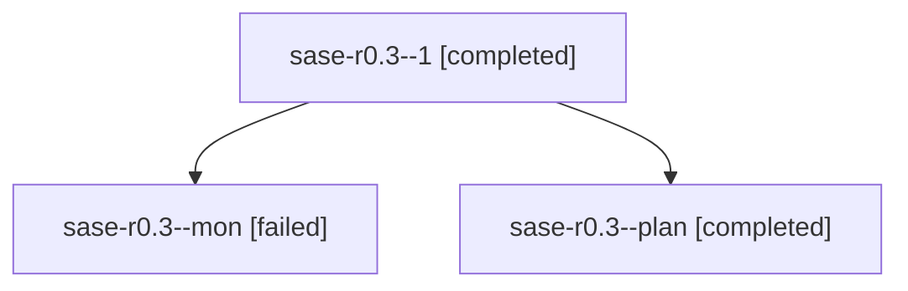

# Family: sase-r0.3

[Agent Hoods](../README.md) / [bbugyi200](../users/bbugyi200/README.md) / [athena](../users/bbugyi200/machines/athena/README.md) / [sase-r0](../users/bbugyi200/machines/athena/hoods/sase-r0/README.md) / sase-r0.3

Owner: `bbugyi200.athena` · Hood: `sase-r0` · Members: 3 · Bead: [sase-r0.3](https://github.com/sase-org/sase--beads/blob/main/pages/sase-r0/sase-r0.3.md)

## Lineage

The diagram is an optional enhancement; the ordered table below contains the same lineage in accessible text.

| Role | Agent | State | Model / provider | Timing | Commits | Prompt | Chat |
|---|---|---|---|---|---:|---|---|
| 1 | sase-r0.3--1 | completed | sonnet / claude | 2026-08-19T17:58:00.654137+00:00 | [1](../agents/bbugyi200.athena.sase-r0.3--1/README.md#commits) | [Prompt](../agents/bbugyi200.athena.sase-r0.3--1/prompt.md) | [Chat](../agents/bbugyi200.athena.sase-r0.3--1/chat.md) |
| mon | sase-r0.3--mon | failed | sonnet / claude | 2026-08-19T17:52:44.143337+00:00 | 0 | — | [Chat](../agents/bbugyi200.athena.sase-r0.3--mon/chat.md) |
| plan | sase-r0.3--plan | completed | sonnet / claude | 2026-08-19T17:31:21.478071+00:00 | 0 | [Prompt](../agents/bbugyi200.athena.sase-r0.3--plan/prompt.md) | [Chat](../agents/bbugyi200.athena.sase-r0.3--plan/chat.md) |

## Commits

| Role | Repo | Commit | Subject | Committed |
|---|---|---|---|---|
| 1 | sase | [`be6077c`](https://github.com/sase-org/sase/commit/be6077c7fff3ece4bc40c419565b1ca1338f9eed) | feat(tmux-agent): add catalog, launch-spec, and window-name resolution | 2026-08-19 14:00:47 EDT |

## Neighbors

| Agent | Relation | State |
|---|---|---|
| [sase-r0.1](../agents/bbugyi200.athena.sase-r0.1/README.md) | sase-r0 hood | completed |
| [sase-r0.2](../agents/bbugyi200.athena.sase-r0.2/README.md) | sase-r0 hood | completed |
| [sase-r0.4](../agents/bbugyi200.athena.sase-r0.4/README.md) | sase-r0 hood | completed |
| [sase-r0.5](../agents/bbugyi200.athena.sase-r0.5/README.md) | sase-r0 hood | active |
| [sase-r0.6](../agents/bbugyi200.athena.sase-r0.6/README.md) | sase-r0 hood | waiting |
| [sase-r0.7](../agents/bbugyi200.athena.sase-r0.7/README.md) | sase-r0 hood | completed |
| [sase-r0.8](../agents/bbugyi200.athena.sase-r0.8/README.md) | sase-r0 hood | waiting |
| [sase-r0.land](../agents/bbugyi200.athena.sase-r0.land/README.md) | sase-r0 hood | waiting |
