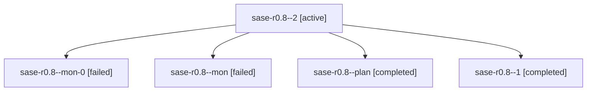

# Family: sase-r0.8

[Agent Hoods](../README.md) / [bbugyi200](../users/bbugyi200/README.md) / [athena](../users/bbugyi200/machines/athena/README.md) / [sase-r0](../users/bbugyi200/machines/athena/hoods/sase-r0/README.md) / sase-r0.8

Owner: `bbugyi200.athena` · Hood: `sase-r0` · Members: 5 · Bead: [sase-r0.8](https://github.com/sase-org/sase--beads/blob/main/pages/sase-r0/sase-r0.8.md)

## Lineage

The diagram is an optional enhancement; the ordered table below contains the same lineage in accessible text.

| Role | Agent | State | Model / provider | Timing | Commits | Prompt | Chat |
|---|---|---|---|---|---:|---|---|
| 2 | sase-r0.8--2 | active | grok-4.6 / grok | 2026-08-19T21:43:50.260287+00:00 | 0 | [Prompt](../agents/bbugyi200.athena.sase-r0.8--2/prompt.md) | — |
| mon-0 | sase-r0.8--mon-0 | failed | grok-4.6 / grok | 2026-08-19T21:07:00.924838+00:00 | 0 | — | [Chat](../agents/bbugyi200.athena.sase-r0.8--mon-0/chat.md) |
| mon | sase-r0.8--mon | failed | grok-4.6 / grok | 2026-08-19T20:09:27.542219+00:00 | 0 | — | [Chat](../agents/bbugyi200.athena.sase-r0.8--mon/chat.md) |
| plan | sase-r0.8--plan | completed | grok-4.6 / grok | 2026-08-19T19:23:45.249052+00:00 | 0 | [Prompt](../agents/bbugyi200.athena.sase-r0.8--plan/prompt.md) | [Chat](../agents/bbugyi200.athena.sase-r0.8--plan/chat.md) |
| 1 | sase-r0.8--1 | completed | grok-4.6 / grok | 2026-08-19T20:19:56.474988+00:00 | 0 | [Prompt](../agents/bbugyi200.athena.sase-r0.8--1/prompt.md) | [Chat](../agents/bbugyi200.athena.sase-r0.8--1/chat.md) |

## Neighbors

| Agent | Relation | State |
|---|---|---|
| [sase-r0.1](../agents/bbugyi200.athena.sase-r0.1/README.md) | sase-r0 hood | completed |
| [sase-r0.2](../agents/bbugyi200.athena.sase-r0.2/README.md) | sase-r0 hood | completed |
| [sase-r0.3](bbugyi200.athena.sase-r0.3.md) (family · 3) | sase-r0 hood | completed 2, failed 1 |
| [sase-r0.4](../agents/bbugyi200.athena.sase-r0.4/README.md) | sase-r0 hood | completed |
| [sase-r0.5](../agents/bbugyi200.athena.sase-r0.5/README.md) | sase-r0 hood | completed |
| [sase-r0.6](../agents/bbugyi200.athena.sase-r0.6/README.md) | sase-r0 hood | completed |
| [sase-r0.7](../agents/bbugyi200.athena.sase-r0.7/README.md) | sase-r0 hood | completed |
| [sase-r0.land](../agents/bbugyi200.athena.sase-r0.land/README.md) | sase-r0 hood | waiting |
