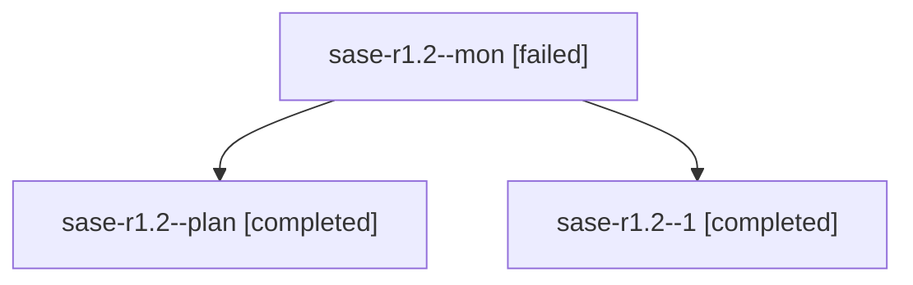

# Family: sase-r1.2

[Agent Hoods](../README.md) / [bbugyi200](../users/bbugyi200/README.md) / [athena](../users/bbugyi200/machines/athena/README.md) / [sase-r1](../users/bbugyi200/machines/athena/hoods/sase-r1/README.md) / sase-r1.2

Owner: `bbugyi200.athena` · Hood: `sase-r1` · Members: 3 · Bead: [sase-r1.2](https://github.com/sase-org/sase--beads/blob/main/pages/sase-r1/sase-r1.2.md)

## Lineage

The diagram is an optional enhancement; the ordered table below contains the same lineage in accessible text.

| Role | Agent | State | Model / provider | Timing | Commits | Prompt | Chat |
|---|---|---|---|---|---:|---|---|
| mon | sase-r1.2--mon | failed | grok-4.6 / grok | 2026-08-19T17:35:07.574308+00:00 | 0 | — | [Chat](../agents/bbugyi200.athena.sase-r1.2--mon/chat.md) |
| plan | sase-r1.2--plan | completed | grok-4.6 / grok | 2026-08-19T16:23:29.859637+00:00 | 0 | [Prompt](../agents/bbugyi200.athena.sase-r1.2--plan/prompt.md) | [Chat](../agents/bbugyi200.athena.sase-r1.2--plan/chat.md) |
| 1 | sase-r1.2--1 | completed | grok-4.6 / grok | 2026-08-19T18:03:01.540917+00:00 | 0 | [Prompt](../agents/bbugyi200.athena.sase-r1.2--1/prompt.md) | [Chat](../agents/bbugyi200.athena.sase-r1.2--1/chat.md) |

## Commits

| Role | Repo | Commit | Subject | Committed |
|---|---|---|---|---|
| — | sase | [`ba03cec`](https://github.com/sase-org/sase/commit/ba03cec630e37b70d0e92da78acdbba2437f80e4) | feat(ace): scope comprehensive update preview to selected legs | 2026-08-19 14:11:14 EDT |

## Neighbors

| Agent | Relation | State |
|---|---|---|
| [sase-r1.1](../agents/bbugyi200.athena.sase-r1.1/README.md) | sase-r1 hood | completed |
| [sase-r1.3](../agents/bbugyi200.athena.sase-r1.3/README.md) | sase-r1 hood | completed |
| [sase-r1.4](../agents/bbugyi200.athena.sase-r1.4/README.md) | sase-r1 hood | completed |
| [sase-r1.5](../agents/bbugyi200.athena.sase-r1.5/README.md) | sase-r1 hood | completed |
| [sase-r1.6](../agents/bbugyi200.athena.sase-r1.6/README.md) | sase-r1 hood | completed |
| [sase-r1.7](bbugyi200.athena.sase-r1.7.md) (family · 5) | sase-r1 hood | completed 3, failed 2 |
| [sase-r1.land](../agents/bbugyi200.athena.sase-r1.land/README.md) | sase-r1 hood | completed |
