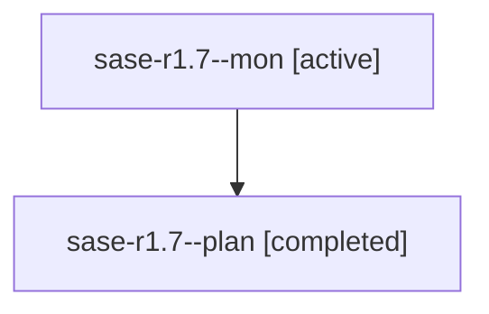

# Family: sase-r1.7

[Agent Hoods](../README.md) / [bbugyi200](../users/bbugyi200/README.md) / [athena](../users/bbugyi200/machines/athena/README.md) / [sase-r1](../users/bbugyi200/machines/athena/hoods/sase-r1/README.md) / sase-r1.7

Owner: `bbugyi200.athena` · Hood: `sase-r1` · Members: 2 · Bead: [sase-r1.7](https://github.com/sase-org/sase--beads/blob/main/pages/sase-r1/sase-r1.7.md)

## Lineage

The diagram is an optional enhancement; the ordered table below contains the same lineage in accessible text.

| Role | Agent | State | Model / provider | Timing | Commits | Prompt | Chat |
|---|---|---|---|---|---:|---|---|
| mon | sase-r1.7--mon | active | grok-4.6 / grok | 2026-08-19T20:43:56.471218+00:00 | 0 | — | — |
| plan | sase-r1.7--plan | completed | grok-4.6 / grok | 2026-08-19T20:21:13.030640+00:00 | 0 | [Prompt](../agents/bbugyi200.athena.sase-r1.7--plan/prompt.md) | [Chat](../agents/bbugyi200.athena.sase-r1.7--plan/chat.md) |

## Neighbors

| Agent | Relation | State |
|---|---|---|
| [sase-r1.1](../agents/bbugyi200.athena.sase-r1.1/README.md) | sase-r1 hood | completed |
| [sase-r1.2](bbugyi200.athena.sase-r1.2.md) (family · 3) | sase-r1 hood | completed 2, failed 1 |
| [sase-r1.3](../agents/bbugyi200.athena.sase-r1.3/README.md) | sase-r1 hood | completed |
| [sase-r1.4](../agents/bbugyi200.athena.sase-r1.4/README.md) | sase-r1 hood | completed |
| [sase-r1.5](../agents/bbugyi200.athena.sase-r1.5/README.md) | sase-r1 hood | completed |
| [sase-r1.6](../agents/bbugyi200.athena.sase-r1.6/README.md) | sase-r1 hood | completed |
| [sase-r1.land](../agents/bbugyi200.athena.sase-r1.land/README.md) | sase-r1 hood | waiting |
