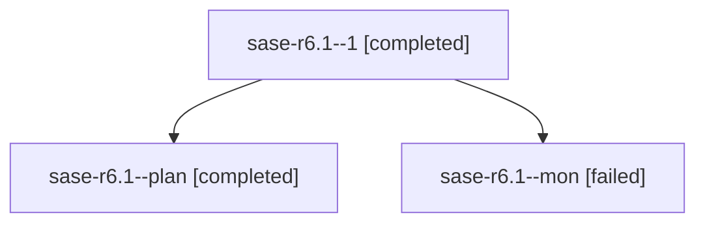

# Family: sase-r6.1

[Agent Hoods](../README.md) / [bbugyi200](../users/bbugyi200/README.md) / [athena](../users/bbugyi200/machines/athena/README.md) / [sase-r6](../users/bbugyi200/machines/athena/hoods/sase-r6/README.md) / sase-r6.1

Owner: `bbugyi200.athena` · Hood: `sase-r6` · Members: 3 · Bead: [sase-r6.1](https://github.com/sase-org/sase--beads/blob/main/pages/sase-r6/sase-r6.1.md)

## Lineage

The diagram is an optional enhancement; the ordered table below contains the same lineage in accessible text.

| Role | Agent | State | Model / provider | Timing | Commits | Prompt | Chat |
|---|---|---|---|---|---:|---|---|
| 1 | sase-r6.1--1 | completed | grok-4.6 / grok | 2026-08-19T22:22:23.486754+00:00 | [1](../agents/bbugyi200.athena.sase-r6.1--1/README.md#commits) | [Prompt](../agents/bbugyi200.athena.sase-r6.1--1/prompt.md) | [Chat](../agents/bbugyi200.athena.sase-r6.1--1/chat.md) |
| plan | sase-r6.1--plan | completed | grok-4.6 / grok | 2026-08-19T21:18:44.881275+00:00 | 0 | [Prompt](../agents/bbugyi200.athena.sase-r6.1--plan/prompt.md) | [Chat](../agents/bbugyi200.athena.sase-r6.1--plan/chat.md) |
| mon | sase-r6.1--mon | failed | grok-4.6 / grok | 2026-08-19T22:10:06.717824+00:00 | 0 | — | [Chat](../agents/bbugyi200.athena.sase-r6.1--mon/chat.md) |

## Commits

| Role | Repo | Commit | Subject | Committed |
|---|---|---|---|---|
| 1 | sase | [`35ba42c`](https://github.com/sase-org/sase/commit/35ba42ce77d39ad9974bac8b4ab8869f0b30ff41) | feat(ace): add page\_size config and shared limit-token helpers | 2026-08-19 18:27:42 EDT |

## Neighbors

| Agent | Relation | State |
|---|---|---|
| [sase-r6.2](../agents/bbugyi200.athena.sase-r6.2/README.md) | sase-r6 hood | completed |
| [sase-r6.3](../agents/bbugyi200.athena.sase-r6.3/README.md) | sase-r6 hood | completed |
| [sase-r6.4](../agents/bbugyi200.athena.sase-r6.4/README.md) | sase-r6 hood | completed |
| [sase-r6.land](bbugyi200.athena.sase-r6.land.md) (family · 3) | sase-r6 hood | active 1, completed 1, failed 1 |
