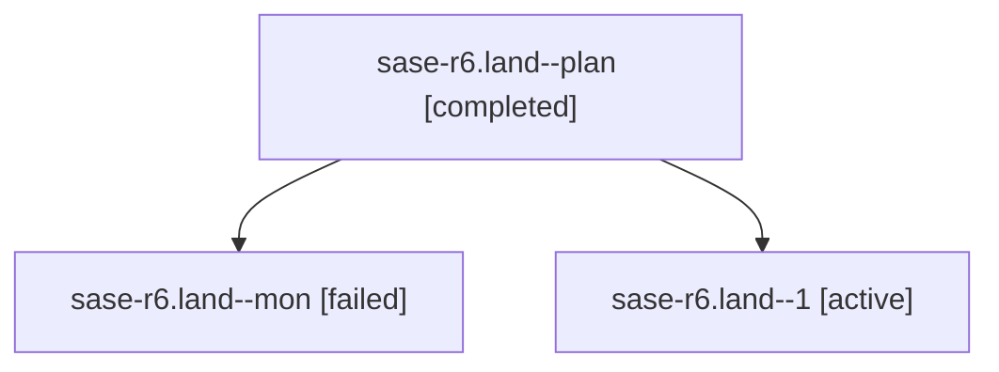

# Family: sase-r6.land

[Agent Hoods](../README.md) / [bbugyi200](../users/bbugyi200/README.md) / [athena](../users/bbugyi200/machines/athena/README.md) / [sase-r6](../users/bbugyi200/machines/athena/hoods/sase-r6/README.md) / sase-r6.land

Owner: `bbugyi200.athena` · Hood: `sase-r6` · Members: 3 · Bead: [sase-r6](https://github.com/sase-org/sase--beads/blob/main/pages/sase-r6/README.md)

## Lineage

The diagram is an optional enhancement; the ordered table below contains the same lineage in accessible text.

| Role | Agent | State | Model / provider | Timing | Commits | Prompt | Chat |
|---|---|---|---|---|---:|---|---|
| plan | sase-r6.land--plan | completed | grok-4.6 / grok | 2026-08-20T01:08:50.467212+00:00 | 0 | [Prompt](../agents/bbugyi200.athena.sase-r6.land--plan/prompt.md) | [Chat](../agents/bbugyi200.athena.sase-r6.land--plan/chat.md) |
| mon | sase-r6.land--mon | failed | grok-4.6 / grok | 2026-08-20T01:29:40.708038+00:00 | 0 | — | [Chat](../agents/bbugyi200.athena.sase-r6.land--mon/chat.md) |
| 1 | sase-r6.land--1 | active | grok-4.6 / grok | 2026-08-20T01:39:37.801769+00:00 | [1](../agents/bbugyi200.athena.sase-r6.land--1/README.md#commits) | [Prompt](../agents/bbugyi200.athena.sase-r6.land--1/prompt.md) | — |

## Commits

| Role | Repo | Commit | Subject | Committed |
|---|---|---|---|---|
| 1 | sase | [`d11ebe6`](https://github.com/sase-org/sase/commit/d11ebe69554ccec5434feb52fd3ef3375e7e8877) | docs(ace): align Stitches default\_query comment with injected limit | 2026-08-19 21:49:27 EDT |

## Neighbors

| Agent | Relation | State |
|---|---|---|
| [sase-r6.1](bbugyi200.athena.sase-r6.1.md) (family · 3) | sase-r6 hood | completed 2, failed 1 |
| [sase-r6.2](../agents/bbugyi200.athena.sase-r6.2/README.md) | sase-r6 hood | completed |
| [sase-r6.3](../agents/bbugyi200.athena.sase-r6.3/README.md) | sase-r6 hood | completed |
| [sase-r6.4](../agents/bbugyi200.athena.sase-r6.4/README.md) | sase-r6 hood | completed |
