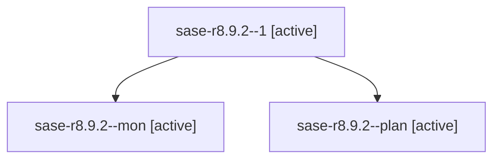

# Family: sase-r8.9.2

[Agent Hoods](../README.md) / [bbugyi200](../users/bbugyi200/README.md) / [athena](../users/bbugyi200/machines/athena/README.md) / [sase-r8](../users/bbugyi200/machines/athena/hoods/sase-r8/README.md) / sase-r8.9.2

Owner: `bbugyi200.athena` · Hood: `sase-r8` · Members: 3 · Bead: [sase-r8.9.2](https://github.com/sase-org/sase--beads/blob/main/pages/sase-r8/sase-r8.9.2.md)

## Lineage

The diagram is an optional enhancement; the ordered table below contains the same lineage in accessible text.

| Role | Agent | State | Model / provider | Timing | Commits | Prompt | Chat |
|---|---|---|---|---|---:|---|---|
| 1 | sase-r8.9.2--1 | active | grok-4.6 / grok | 2026-08-20T15:08:43.062731+00:00 | [1](../agents/bbugyi200.athena.sase-r8.9.2--1/README.md#commits) | [Prompt](../agents/bbugyi200.athena.sase-r8.9.2--1/prompt.md) | — |
| mon | sase-r8.9.2--mon | active | grok-4.6 / grok | 2026-08-20T15:02:23.258359+00:00 | 0 | — | — |
| plan | sase-r8.9.2--plan | active | grok-4.6 / grok | 2026-08-20T14:37:19.097208+00:00 | 0 | [Prompt](../agents/bbugyi200.athena.sase-r8.9.2--plan/prompt.md) | [Chat](../agents/bbugyi200.athena.sase-r8.9.2--plan/chat.md) |

## Commits

| Role | Repo | Commit | Subject | Committed |
|---|---|---|---|---|
| 1 | sase | [`43b79bf`](https://github.com/sase-org/sase/commit/43b79bf12b5b8c0ef5376319fec8991e7327812a) | build(deps): raise sase-core-rs floor to 0.29.5 | 2026-08-20 11:14:24 EDT |

## Neighbors

| Agent | Relation | State |
|---|---|---|
| [sase-r8.9.1](bbugyi200.athena.sase-r8.9.1.md) (family · 3) | sase-r8.9 hood | active 3 |
| [sase-r8.9.land](../agents/bbugyi200.athena.sase-r8.9.land/README.md) | sase-r8.9 hood | active |
| [sase-r8.1](../agents/bbugyi200.athena.sase-r8.1/README.md) | sase-r8 hood | active |
| [sase-r8.2](../agents/bbugyi200.athena.sase-r8.2/README.md) | sase-r8 hood | active |
| [sase-r8.3](../agents/bbugyi200.athena.sase-r8.3/README.md) | sase-r8 hood | active |
| [sase-r8.4](../agents/bbugyi200.athena.sase-r8.4/README.md) | sase-r8 hood | active |
| [sase-r8.5](../agents/bbugyi200.athena.sase-r8.5/README.md) | sase-r8 hood | active |
| [sase-r8.6](../agents/bbugyi200.athena.sase-r8.6/README.md) | sase-r8 hood | active |
| [sase-r8.7](../agents/bbugyi200.athena.sase-r8.7/README.md) | sase-r8 hood | active |
| [sase-r8.8](../agents/bbugyi200.athena.sase-r8.8/README.md) | sase-r8 hood | active |
| [sase-r8.land](bbugyi200.athena.sase-r8.land.md) (family · 2) | sase-r8 hood | active 2 |
