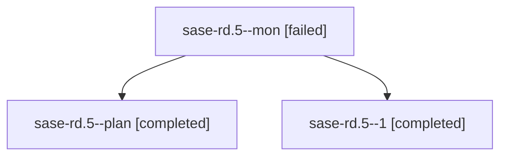

# Family: sase-rd.5

[Agent Hoods](../README.md) / [bbugyi200](../users/bbugyi200/README.md) / [athena](../users/bbugyi200/machines/athena/README.md) / [sase-rd](../users/bbugyi200/machines/athena/hoods/sase-rd/README.md) / sase-rd.5

Owner: `bbugyi200.athena` · Hood: `sase-rd` · Members: 3 · Bead: [sase-rd.5](https://github.com/sase-org/sase--beads/blob/main/pages/sase-rd/sase-rd.5.md)

## Lineage

The diagram is an optional enhancement; the ordered table below contains the same lineage in accessible text.

| Role | Agent | State | Model / provider | Timing | Commits | Prompt | Chat |
|---|---|---|---|---|---:|---|---|
| mon | sase-rd.5--mon | failed | grok-4.6 / grok | 2026-08-20T15:37:24.664393+00:00 | 0 | — | [Chat](../agents/bbugyi200.athena.sase-rd.5--mon/chat.md) |
| plan | sase-rd.5--plan | completed | grok-4.6 / grok | 2026-08-20T14:28:06.537763+00:00 | 0 | [Prompt](../agents/bbugyi200.athena.sase-rd.5--plan/prompt.md) | [Chat](../agents/bbugyi200.athena.sase-rd.5--plan/chat.md) |
| 1 | sase-rd.5--1 | completed | grok-4.6 / grok | 2026-08-20T15:55:32.603393+00:00 | [1](../agents/bbugyi200.athena.sase-rd.5--1/README.md#commits) | [Prompt](../agents/bbugyi200.athena.sase-rd.5--1/prompt.md) | [Chat](../agents/bbugyi200.athena.sase-rd.5--1/chat.md) |

## Commits

| Role | Repo | Commit | Subject | Committed |
|---|---|---|---|---|
| 1 | sase | [`4f87eb4`](https://github.com/sase-org/sase/commit/4f87eb4b2789609a380ba0f6faf28ad66d48ddf2) | feat(ace): add Snippets panel CRUD and gT prompt entry | 2026-08-20 16:12:30 UTC |

## Neighbors

| Agent | Relation | State |
|---|---|---|
| [sase-rd.1](../agents/bbugyi200.athena.sase-rd.1/README.md) | sase-rd hood | completed |
| [sase-rd.2](../agents/bbugyi200.athena.sase-rd.2/README.md) | sase-rd hood | completed |
| [sase-rd.3](../agents/bbugyi200.athena.sase-rd.3/README.md) | sase-rd hood | completed |
| [sase-rd.4](../agents/bbugyi200.athena.sase-rd.4/README.md) | sase-rd hood | completed |
| [sase-rd.land](../agents/bbugyi200.athena.sase-rd.land/README.md) | sase-rd hood | completed |
| [sase-rd.land.w1](bbugyi200.athena.sase-rd.land.w1.md) (family · 2) | sase-rd hood | failed 2 |
