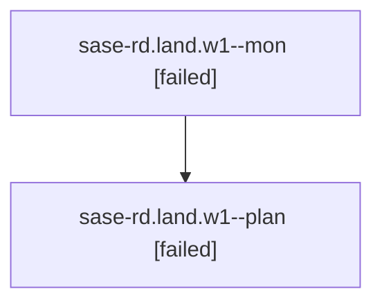

# Family: sase-rd.land.w1

[Agent Hoods](../README.md) / [bbugyi200](../users/bbugyi200/README.md) / [athena](../users/bbugyi200/machines/athena/README.md) / [sase-rd](../users/bbugyi200/machines/athena/hoods/sase-rd/README.md) / sase-rd.land.w1

Owner: `bbugyi200.athena` · Hood: `sase-rd` · Members: 2

## Lineage

The diagram is an optional enhancement; the ordered table below contains the same lineage in accessible text.

| Role | Agent | State | Model / provider | Timing | Commits | Prompt | Chat |
|---|---|---|---|---|---:|---|---|
| mon | sase-rd.land.w1--mon | failed | gpt-5.6-sol / codex | 2026-08-20T16:42:55.653542+00:00 | 0 | — | [Chat](../agents/bbugyi200.athena.sase-rd.land.w1--mon/chat.md) |
| plan | sase-rd.land.w1--plan | failed | gpt-5.6-sol / codex | 2026-08-20T16:29:14.433473+00:00 | 0 | [Prompt](../agents/bbugyi200.athena.sase-rd.land.w1--plan/prompt.md) | [Chat](../agents/bbugyi200.athena.sase-rd.land.w1--plan/chat.md) |

## Neighbors

| Agent | Relation | State |
|---|---|---|
| [sase-rd.land](../agents/bbugyi200.athena.sase-rd.land/README.md) | ancestor | completed |
| [sase-rd.1](../agents/bbugyi200.athena.sase-rd.1/README.md) | sase-rd hood | completed |
| [sase-rd.2](../agents/bbugyi200.athena.sase-rd.2/README.md) | sase-rd hood | completed |
| [sase-rd.3](../agents/bbugyi200.athena.sase-rd.3/README.md) | sase-rd hood | completed |
| [sase-rd.4](../agents/bbugyi200.athena.sase-rd.4/README.md) | sase-rd hood | completed |
| [sase-rd.5](bbugyi200.athena.sase-rd.5.md) (family · 3) | sase-rd hood | completed 2, failed 1 |
