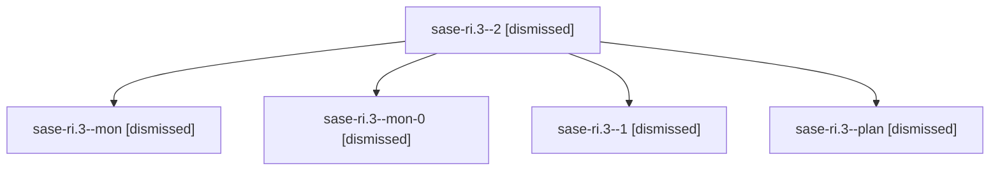

# Family: sase-ri.3

[Agent Hoods](../README.md) / [bbugyi200](../users/bbugyi200/README.md) / [athena](../users/bbugyi200/machines/athena/README.md) / [sase-ri](../users/bbugyi200/machines/athena/hoods/sase-ri/README.md) / sase-ri.3

Owner: `bbugyi200.athena` · Hood: `sase-ri` · Members: 5 · Bead: [sase-ri.3](https://github.com/sase-org/sase--beads/blob/main/pages/sase-ri/sase-ri.3.md)

## Lineage

The diagram is an optional enhancement; the ordered table below contains the same lineage in accessible text.

| Role | Agent | State | Model / provider | Timing | Commits | Prompt | Chat |
|---|---|---|---|---|---:|---|---|
| 2 | sase-ri.3--2 | dismissed | — | 2026-08-20T14:01:45 | 0 | — | — |
| mon | sase-ri.3--mon | dismissed | — | 2026-08-20T13:17:51 | 0 | — | — |
| mon-0 | sase-ri.3--mon-0 | dismissed | — | 2026-08-20T13:43:59 | 0 | — | — |
| 1 | sase-ri.3--1 | dismissed | — | 2026-08-20T13:37:01 | 0 | — | — |
| plan | sase-ri.3--plan | dismissed | — | 2026-08-20T12:43:51 | 0 | — | — |

## Commits

| Role | Repo | Commit | Subject | Committed |
|---|---|---|---|---|
| — | sase | [`4c304ad`](https://github.com/sase-org/sase/commit/4c304ad1fb78a611f7caa23ed9b6c9b3a1c0103c) | refactor(tui): extract reusable snippets pane | 2026-08-20 13:39:06 EDT |

## Neighbors

| Agent | Relation | State |
|---|---|---|
| [sase-ri.1](../agents/bbugyi200.athena.sase-ri.1/README.md) | sase-ri hood | dismissed |
| [sase-ri.2](../agents/bbugyi200.athena.sase-ri.2/README.md) | sase-ri hood | dismissed |
| [sase-ri.4](../agents/bbugyi200.athena.sase-ri.4/README.md) | sase-ri hood | dismissed |
| [sase-ri.5](../agents/bbugyi200.athena.sase-ri.5/README.md) | sase-ri hood | dismissed |
| [sase-ri.land](../agents/bbugyi200.athena.sase-ri.land/README.md) | sase-ri hood | dismissed |
| [sase-ri.land.w1.f0](../agents/bbugyi200.athena.sase-ri.land.w1.f0/README.md) | sase-ri hood | dismissed |
| [sase-ri.land.w2](bbugyi200.athena.sase-ri.land.w2.md) (family · 2) | sase-ri hood | failed 2 |
| [sase-ri.land.w2.f0](../agents/bbugyi200.athena.sase-ri.land.w2.f0/README.md) | sase-ri hood | dismissed |
| [sase-ri.land.w2.f1](../agents/bbugyi200.athena.sase-ri.land.w2.f1/README.md) | sase-ri hood | dismissed |
| [sase-ri.land.w2.f2.f0](../agents/bbugyi200.athena.sase-ri.land.w2.f2.f0/README.md) | sase-ri hood | dismissed |
| [sase-ri.land.w2.f2.f1](../agents/bbugyi200.athena.sase-ri.land.w2.f2.f1/README.md) | sase-ri hood | dismissed |
| [sase-ri.land.w2.f2.f3](../agents/bbugyi200.athena.sase-ri.land.w2.f2.f3/README.md) | sase-ri hood | active |
| [sase-ri.land.w2.f2.w2](bbugyi200.athena.sase-ri.land.w2.f2.w2.md) (family · 4) | sase-ri hood | completed 3, failed 1 |
| [sase-ri.land.w2.f2.w2.f1](bbugyi200.athena.sase-ri.land.w2.f2.w2.f1.md) (family · 2) | sase-ri hood | active 2 |
| [sase-ri.land.w2.f2.w3](bbugyi200.athena.sase-ri.land.w2.f2.w3.md) (family · 4) | sase-ri hood | active 1, completed 2, failed 1 |
| [sase-ri.land.w2.f3](bbugyi200.athena.sase-ri.land.w2.f3.md) (family · 2) | sase-ri hood | completed 2 |
