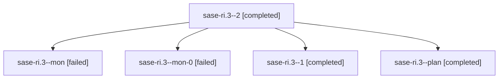

# Family: sase-ri.3

[Agent Hoods](../README.md) / [bbugyi200](../users/bbugyi200/README.md) / [athena](../users/bbugyi200/machines/athena/README.md) / [sase-ri](../users/bbugyi200/machines/athena/hoods/sase-ri/README.md) / sase-ri.3

Owner: `bbugyi200.athena` · Hood: `sase-ri` · Members: 5 · Bead: [sase-ri.3](https://github.com/sase-org/sase--beads/blob/main/pages/sase-ri/sase-ri.3.md)

## Lineage

The diagram is an optional enhancement; the ordered table below contains the same lineage in accessible text.

| Role | Agent | State | Model / provider | Timing | Commits | Prompt | Chat |
|---|---|---|---|---|---:|---|---|
| 2 | sase-ri.3--2 | completed | gpt-5.5 / codex | 2026-08-20T18:02:02.373120+00:00 | 0 | [Prompt](../agents/bbugyi200.athena.sase-ri.3--2/prompt.md) | [Chat](../agents/bbugyi200.athena.sase-ri.3--2/chat.md) |
| mon | sase-ri.3--mon | failed | gpt-5.5 / codex | 2026-08-20T17:17:51.344214+00:00 | 0 | — | [Chat](../agents/bbugyi200.athena.sase-ri.3--mon/chat.md) |
| mon-0 | sase-ri.3--mon-0 | failed | gpt-5.5 / codex | 2026-08-20T17:43:59.771437+00:00 | 0 | — | [Chat](../agents/bbugyi200.athena.sase-ri.3--mon-0/chat.md) |
| 1 | sase-ri.3--1 | completed | gpt-5.5 / codex | 2026-08-20T17:37:08.251733+00:00 | 0 | [Prompt](../agents/bbugyi200.athena.sase-ri.3--1/prompt.md) | [Chat](../agents/bbugyi200.athena.sase-ri.3--1/chat.md) |
| plan | sase-ri.3--plan | completed | gpt-5.5 / codex | 2026-08-20T16:44:27.870863+00:00 | [1](../agents/bbugyi200.athena.sase-ri.3--plan/README.md#commits) | [Prompt](../agents/bbugyi200.athena.sase-ri.3--plan/prompt.md) | [Chat](../agents/bbugyi200.athena.sase-ri.3--plan/chat.md) |

## Commits

| Role | Repo | Commit | Subject | Committed |
|---|---|---|---|---|
| plan | sase | [`4c304ad`](https://github.com/sase-org/sase/commit/4c304ad1fb78a611f7caa23ed9b6c9b3a1c0103c) | refactor(tui): extract reusable snippets pane | 2026-08-20 13:39:06 EDT |

## Neighbors

| Agent | Relation | State |
|---|---|---|
| [sase-ri.1](../agents/bbugyi200.athena.sase-ri.1/README.md) | sase-ri hood | completed |
| [sase-ri.2](../agents/bbugyi200.athena.sase-ri.2/README.md) | sase-ri hood | completed |
| [sase-ri.4](../agents/bbugyi200.athena.sase-ri.4/README.md) | sase-ri hood | completed |
| [sase-ri.5](../agents/bbugyi200.athena.sase-ri.5/README.md) | sase-ri hood | active |
| [sase-ri.land](../agents/bbugyi200.athena.sase-ri.land/README.md) | sase-ri hood | waiting |
| [sase-ri.land.w1](../agents/bbugyi200.athena.sase-ri.land.w1/README.md) | sase-ri hood | waiting |
| [sase-ri.land.w1.f0](../agents/bbugyi200.athena.sase-ri.land.w1.f0/README.md) | sase-ri hood | waiting |
