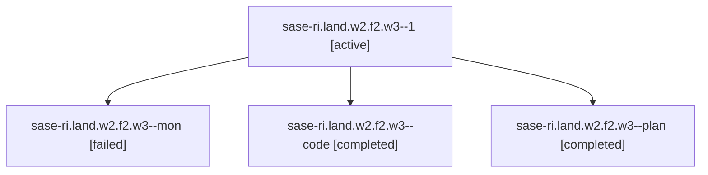

# Family: sase-ri.land.w2.f2.w3

[Agent Hoods](../README.md) / [bbugyi200](../users/bbugyi200/README.md) / [athena](../users/bbugyi200/machines/athena/README.md) / [sase-ri](../users/bbugyi200/machines/athena/hoods/sase-ri/README.md) / sase-ri.land.w2.f2.w3

Owner: `bbugyi200.athena` · Hood: `sase-ri` · Members: 4

## Lineage

The diagram is an optional enhancement; the ordered table below contains the same lineage in accessible text.

| Role | Agent | State | Model / provider | Timing | Commits | Prompt | Chat |
|---|---|---|---|---|---:|---|---|
| 1 | sase-ri.land.w2.f2.w3--1 | active | grok-4.6 / grok | 2026-08-21T14:37:46.254940+00:00 | [1](../agents/bbugyi200.athena.sase-ri.land.w2.f2.w3--1/README.md#commits) | [Prompt](../agents/bbugyi200.athena.sase-ri.land.w2.f2.w3--1/prompt.md) | — |
| mon | sase-ri.land.w2.f2.w3--mon | failed | grok-4.6 / grok | 2026-08-21T14:30:55.764593+00:00 | 0 | — | [Chat](../agents/bbugyi200.athena.sase-ri.land.w2.f2.w3--mon/chat.md) |
| code | sase-ri.land.w2.f2.w3--code | completed | grok-4.6 / grok | 2026-08-21T13:53:03.475378+00:00 | 0 | — | [Chat](../agents/bbugyi200.athena.sase-ri.land.w2.f2.w3--code/chat.md) |
| plan | sase-ri.land.w2.f2.w3--plan | completed | gpt-5.6-sol / codex | 2026-08-21T13:45:23.067224+00:00 | 0 | [Prompt](../agents/bbugyi200.athena.sase-ri.land.w2.f2.w3--plan/prompt.md) | [Chat](../agents/bbugyi200.athena.sase-ri.land.w2.f2.w3--plan/chat.md) |

## Commits

| Role | Repo | Commit | Subject | Committed |
|---|---|---|---|---|
| 1 | sase | [`d5b101a`](https://github.com/sase-org/sase/commit/d5b101ab2eaded2bde57daf572dbe0e556eb2da0) | feat(ace): browse-first Config XPrompts slash filter | 2026-08-21 14:42:35 UTC |

## Neighbors

| Agent | Relation | State |
|---|---|---|
| [sase-ri.land.w2](bbugyi200.athena.sase-ri.land.w2.md) (family · 2) | ancestor | failed 2 |
| [sase-ri.land](../agents/bbugyi200.athena.sase-ri.land/README.md) | ancestor | dismissed |
| [sase-ri.land.w2.f2.f0](../agents/bbugyi200.athena.sase-ri.land.w2.f2.f0/README.md) | sase-ri.land.w2.f2 hood | dismissed |
| [sase-ri.land.w2.f2.f1](../agents/bbugyi200.athena.sase-ri.land.w2.f2.f1/README.md) | sase-ri.land.w2.f2 hood | dismissed |
| [sase-ri.land.w2.f2.f3](../agents/bbugyi200.athena.sase-ri.land.w2.f2.f3/README.md) | sase-ri.land.w2.f2 hood | active |
| [sase-ri.land.w2.f2.w2](bbugyi200.athena.sase-ri.land.w2.f2.w2.md) (family · 4) | sase-ri.land.w2.f2 hood | completed 3, failed 1 |
| [sase-ri.land.w2.f2.w2.f1](bbugyi200.athena.sase-ri.land.w2.f2.w2.f1.md) (family · 2) | sase-ri.land.w2.f2 hood | active 2 |
| [sase-ri.land.w2.f0](../agents/bbugyi200.athena.sase-ri.land.w2.f0/README.md) | sase-ri.land.w2 hood | dismissed |
| [sase-ri.land.w2.f1](../agents/bbugyi200.athena.sase-ri.land.w2.f1/README.md) | sase-ri.land.w2 hood | dismissed |
| [sase-ri.land.w2.f3](bbugyi200.athena.sase-ri.land.w2.f3.md) (family · 2) | sase-ri.land.w2 hood | completed 2 |
| [sase-ri.land.w1.f0](../agents/bbugyi200.athena.sase-ri.land.w1.f0/README.md) | sase-ri.land hood | dismissed |
| [sase-ri.1](../agents/bbugyi200.athena.sase-ri.1/README.md) | sase-ri hood | dismissed |
| [sase-ri.2](../agents/bbugyi200.athena.sase-ri.2/README.md) | sase-ri hood | dismissed |
| [sase-ri.3](bbugyi200.athena.sase-ri.3.md) (family · 5) | sase-ri hood | dismissed 5 |
| [sase-ri.4](../agents/bbugyi200.athena.sase-ri.4/README.md) | sase-ri hood | dismissed |
| [sase-ri.5](../agents/bbugyi200.athena.sase-ri.5/README.md) | sase-ri hood | dismissed |
