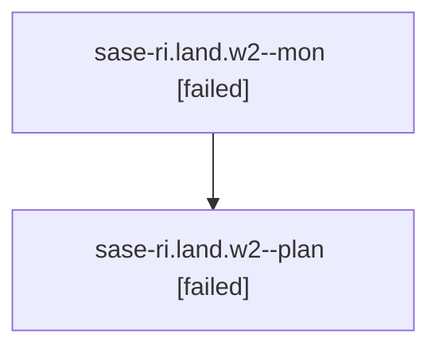

# Family: sase-ri.land.w2

[Agent Hoods](../README.md) / [bbugyi200](../users/bbugyi200/README.md) / [athena](../users/bbugyi200/machines/athena/README.md) / [sase-ri](../users/bbugyi200/machines/athena/hoods/sase-ri/README.md) / sase-ri.land.w2

Owner: `bbugyi200.athena` · Hood: `sase-ri` · Members: 2

## Lineage

The diagram is an optional enhancement; the ordered table below contains the same lineage in accessible text.

| Role | Agent | State | Model / provider | Timing | Commits | Prompt | Chat |
|---|---|---|---|---|---:|---|---|
| mon | sase-ri.land.w2--mon | failed | gpt-5.6-sol / codex | 2026-08-21T10:23:51.945642+00:00 | 0 | — | [Chat](../agents/bbugyi200.athena.sase-ri.land.w2--mon/chat.md) |
| plan | sase-ri.land.w2--plan | failed | gpt-5.6-sol / codex | 2026-08-21T10:14:09.033667+00:00 | 0 | [Prompt](../agents/bbugyi200.athena.sase-ri.land.w2--plan/prompt.md) | [Chat](../agents/bbugyi200.athena.sase-ri.land.w2--plan/chat.md) |

## Neighbors

| Agent | Relation | State |
|---|---|---|
| [sase-ri.land](../agents/bbugyi200.athena.sase-ri.land/README.md) | ancestor | dismissed |
| [sase-ri.land.w2.f0](../agents/bbugyi200.athena.sase-ri.land.w2.f0/README.md) | descendant | dismissed |
| [sase-ri.land.w2.f1](../agents/bbugyi200.athena.sase-ri.land.w2.f1/README.md) | descendant | dismissed |
| [sase-ri.land.w2.f2.f0](../agents/bbugyi200.athena.sase-ri.land.w2.f2.f0/README.md) | descendant | dismissed |
| [sase-ri.land.w2.f2.f1](../agents/bbugyi200.athena.sase-ri.land.w2.f2.f1/README.md) | descendant | dismissed |
| [sase-ri.land.w2.f2.f3](../agents/bbugyi200.athena.sase-ri.land.w2.f2.f3/README.md) | descendant | active |
| [sase-ri.land.w2.f2.w2](bbugyi200.athena.sase-ri.land.w2.f2.w2.md) (family · 2) | descendant | active 2 |
| [sase-ri.land.w2.f2.w2.f0](../agents/bbugyi200.athena.sase-ri.land.w2.f2.w2.f0/README.md) | descendant | waiting |
| [sase-ri.land.w2.f2.w3](bbugyi200.athena.sase-ri.land.w2.f2.w3.md) (family · 2) | descendant | active 2 |
| [sase-ri.land.w2.f3](bbugyi200.athena.sase-ri.land.w2.f3.md) (family · 2) | descendant | completed 2 |
| [sase-ri.land.w1.f0](../agents/bbugyi200.athena.sase-ri.land.w1.f0/README.md) | sase-ri.land hood | dismissed |
| [sase-ri.1](../agents/bbugyi200.athena.sase-ri.1/README.md) | sase-ri hood | dismissed |
| [sase-ri.2](../agents/bbugyi200.athena.sase-ri.2/README.md) | sase-ri hood | dismissed |
| [sase-ri.3](bbugyi200.athena.sase-ri.3.md) (family · 5) | sase-ri hood | dismissed 5 |
| [sase-ri.4](../agents/bbugyi200.athena.sase-ri.4/README.md) | sase-ri hood | dismissed |
| [sase-ri.5](../agents/bbugyi200.athena.sase-ri.5/README.md) | sase-ri hood | dismissed |
