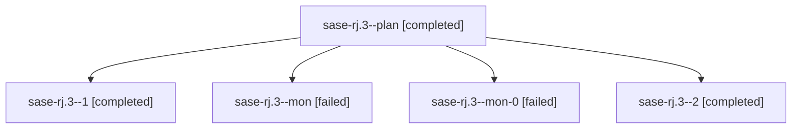

# Family: sase-rj.3

[Agent Hoods](../README.md) / [bbugyi200](../users/bbugyi200/README.md) / [athena](../users/bbugyi200/machines/athena/README.md) / [sase-rj](../users/bbugyi200/machines/athena/hoods/sase-rj/README.md) / sase-rj.3

Owner: `bbugyi200.athena` · Hood: `sase-rj` · Members: 5 · Bead: [sase-rj.3](https://github.com/sase-org/sase--beads/blob/main/pages/sase-rj/sase-rj.3.md)

## Lineage

The diagram is an optional enhancement; the ordered table below contains the same lineage in accessible text.

| Role | Agent | State | Model / provider | Timing | Commits | Prompt | Chat |
|---|---|---|---|---|---:|---|---|
| plan | sase-rj.3--plan | completed | grok-4.6 / grok | 2026-08-20T18:24:10.985932+00:00 | 0 | [Prompt](../agents/bbugyi200.athena.sase-rj.3--plan/prompt.md) | [Chat](../agents/bbugyi200.athena.sase-rj.3--plan/chat.md) |
| 1 | sase-rj.3--1 | completed | grok-4.6 / grok | 2026-08-20T19:25:36.042418+00:00 | 0 | [Prompt](../agents/bbugyi200.athena.sase-rj.3--1/prompt.md) | [Chat](../agents/bbugyi200.athena.sase-rj.3--1/chat.md) |
| mon | sase-rj.3--mon | failed | grok-4.6 / grok | 2026-08-20T19:21:48.916142+00:00 | 0 | — | [Chat](../agents/bbugyi200.athena.sase-rj.3--mon/chat.md) |
| mon-0 | sase-rj.3--mon-0 | failed | grok-4.6 / grok | 2026-08-20T19:33:24.533373+00:00 | 0 | — | [Chat](../agents/bbugyi200.athena.sase-rj.3--mon-0/chat.md) |
| 2 | sase-rj.3--2 | completed | grok-4.6 / grok | 2026-08-20T19:47:34.254606+00:00 | [1](../agents/bbugyi200.athena.sase-rj.3--2/README.md#commits) | [Prompt](../agents/bbugyi200.athena.sase-rj.3--2/prompt.md) | [Chat](../agents/bbugyi200.athena.sase-rj.3--2/chat.md) |

## Commits

| Role | Repo | Commit | Subject | Committed |
|---|---|---|---|---|
| 2 | sase | [`1830524`](https://github.com/sase-org/sase/commit/1830524b09be6ce7c5e62ca007d400e8655734b7) | feat(ace): complete prompt-widget xprompt directive completion | 2026-08-20 15:52:16 EDT |

## Neighbors

| Agent | Relation | State |
|---|---|---|
| [sase-rj.1](../agents/bbugyi200.athena.sase-rj.1/README.md) | sase-rj hood | completed |
| [sase-rj.2](../agents/bbugyi200.athena.sase-rj.2/README.md) | sase-rj hood | completed |
| [sase-rj.4](../agents/bbugyi200.athena.sase-rj.4/README.md) | sase-rj hood | completed |
| [sase-rj.land](../agents/bbugyi200.athena.sase-rj.land/README.md) | sase-rj hood | active |
