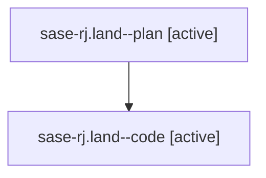

# Family: sase-rj.land

[Agent Hoods](../README.md) / [bbugyi200](../users/bbugyi200/README.md) / [athena](../users/bbugyi200/machines/athena/README.md) / [sase-rj](../users/bbugyi200/machines/athena/hoods/sase-rj/README.md) / sase-rj.land

Owner: `bbugyi200.athena` · Hood: `sase-rj` · Members: 2 · Bead: [sase-rj](https://github.com/sase-org/sase--beads/blob/main/pages/sase-rj/README.md)

## Lineage

The diagram is an optional enhancement; the ordered table below contains the same lineage in accessible text.

| Role | Agent | State | Model / provider | Timing | Commits | Prompt | Chat |
|---|---|---|---|---|---:|---|---|
| plan | sase-rj.land--plan | active | gpt-5.6-sol / codex | 2026-08-21T09:41:05.873653+00:00 | 0 | [Prompt](../agents/bbugyi200.athena.sase-rj.land--plan/prompt.md) | [Chat](../agents/bbugyi200.athena.sase-rj.land--plan/chat.md) |
| code | sase-rj.land--code | active | gpt-5.5 / codex | 2026-08-21T09:48:50.994882+00:00 | 0 | — | — |

## Neighbors

| Agent | Relation | State |
|---|---|---|
| [sase-rj.1](../agents/bbugyi200.athena.sase-rj.1/README.md) | sase-rj hood | completed |
| [sase-rj.2](../agents/bbugyi200.athena.sase-rj.2/README.md) | sase-rj hood | completed |
| [sase-rj.3](bbugyi200.athena.sase-rj.3.md) (family · 5) | sase-rj hood | completed 3, failed 2 |
| [sase-rj.4](../agents/bbugyi200.athena.sase-rj.4/README.md) | sase-rj hood | completed |
