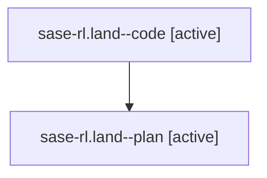

# Family: sase-rl.land

[Agent Hoods](../README.md) / [bbugyi200](../users/bbugyi200/README.md) / [athena](../users/bbugyi200/machines/athena/README.md) / [sase-rl](../users/bbugyi200/machines/athena/hoods/sase-rl/README.md) / sase-rl.land

Owner: `bbugyi200.athena` · Hood: `sase-rl` · Members: 2 · Bead: [sase-rl](https://github.com/sase-org/sase--beads/blob/main/pages/sase-rl/README.md)

## Lineage

The diagram is an optional enhancement; the ordered table below contains the same lineage in accessible text.

| Role | Agent | State | Model / provider | Timing | Commits | Prompt | Chat |
|---|---|---|---|---|---:|---|---|
| code | sase-rl.land--code | active | gpt-5.5 / codex | 2026-08-21T11:00:25.891694+00:00 | [1](../agents/bbugyi200.athena.sase-rl.land--code/README.md#commits) | — | — |
| plan | sase-rl.land--plan | active | gpt-5.6-sol / codex | 2026-08-21T10:53:48.370362+00:00 | 0 | [Prompt](../agents/bbugyi200.athena.sase-rl.land--plan/prompt.md) | [Chat](../agents/bbugyi200.athena.sase-rl.land--plan/chat.md) |

## Commits

| Role | Repo | Commit | Subject | Committed |
|---|---|---|---|---|
| code | sase | [`c1dabb1`](https://github.com/sase-org/sase/commit/c1dabb1b5154109bff5ca3c8397a6685b6886656) | fix(ace): harden mini-xprompt save targets | 2026-08-21 11:26:45 UTC |

## Neighbors

| Agent | Relation | State |
|---|---|---|
| [sase-rl.1](../agents/bbugyi200.athena.sase-rl.1/README.md) | sase-rl hood | completed |
| [sase-rl.2](../agents/bbugyi200.athena.sase-rl.2/README.md) | sase-rl hood | completed |
| [sase-rl.3](../agents/bbugyi200.athena.sase-rl.3/README.md) | sase-rl hood | completed |
| [sase-rl.4](../agents/bbugyi200.athena.sase-rl.4/README.md) | sase-rl hood | completed |
