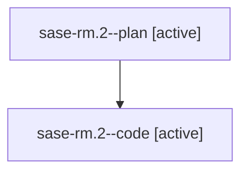

# Family: sase-rm.2

[Agent Hoods](../README.md) / [bbugyi200](../users/bbugyi200/README.md) / [athena](../users/bbugyi200/machines/athena/README.md) / [sase-rm](../users/bbugyi200/machines/athena/hoods/sase-rm/README.md) / sase-rm.2

Owner: `bbugyi200.athena` · Hood: `sase-rm` · Members: 2 · Bead: [sase-rm.2](https://github.com/sase-org/sase--beads/blob/main/pages/sase-rm/sase-rm.2.md)

## Lineage

The diagram is an optional enhancement; the ordered table below contains the same lineage in accessible text.

| Role | Agent | State | Model / provider | Timing | Commits | Prompt | Chat |
|---|---|---|---|---|---:|---|---|
| plan | sase-rm.2--plan | active | gpt-5.6-sol / codex | 2026-08-20T18:50:04.794994+00:00 | 0 | [Prompt](../agents/bbugyi200.athena.sase-rm.2--plan/prompt.md) | [Chat](../agents/bbugyi200.athena.sase-rm.2--plan/chat.md) |
| code | sase-rm.2--code | active | grok-4.6 / grok | 2026-08-20T19:01:48.973966+00:00 | 0 | — | — |

## Neighbors

| Agent | Relation | State |
|---|---|---|
| [sase-rm.1](bbugyi200.athena.sase-rm.1.md) (family · 2) | sase-rm hood | active 2 |
| [sase-rm.10](../agents/bbugyi200.athena.sase-rm.10/README.md) | sase-rm hood | waiting |
| [sase-rm.11](bbugyi200.athena.sase-rm.11.md) (family · 2) | sase-rm hood | active 2 |
| [sase-rm.12](../agents/bbugyi200.athena.sase-rm.12/README.md) | sase-rm hood | active |
| [sase-rm.13](../agents/bbugyi200.athena.sase-rm.13/README.md) | sase-rm hood | waiting |
| [sase-rm.3](bbugyi200.athena.sase-rm.3.md) (family · 2) | sase-rm hood | active 2 |
| [sase-rm.4](../agents/bbugyi200.athena.sase-rm.4/README.md) | sase-rm hood | waiting |
| [sase-rm.5](../agents/bbugyi200.athena.sase-rm.5/README.md) | sase-rm hood | waiting |
| [sase-rm.6](bbugyi200.athena.sase-rm.6.md) (family · 6) | sase-rm hood | active 1, completed 3, failed 2 |
| [sase-rm.7](../agents/bbugyi200.athena.sase-rm.7/README.md) | sase-rm hood | active |
| [sase-rm.8](../agents/bbugyi200.athena.sase-rm.8/README.md) | sase-rm hood | waiting |
| [sase-rm.9](bbugyi200.athena.sase-rm.9.md) (family · 3) | sase-rm hood | completed 2, failed 1 |
| [sase-rm.land](../agents/bbugyi200.athena.sase-rm.land/README.md) | sase-rm hood | waiting |
