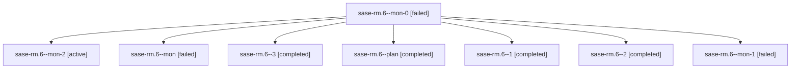

# Family: sase-rm.6

[Agent Hoods](../README.md) / [bbugyi200](../users/bbugyi200/README.md) / [athena](../users/bbugyi200/machines/athena/README.md) / [sase-rm](../users/bbugyi200/machines/athena/hoods/sase-rm/README.md) / sase-rm.6

Owner: `bbugyi200.athena` · Hood: `sase-rm` · Members: 8 · Bead: [sase-rm.6](https://github.com/sase-org/sase--beads/blob/main/pages/sase-rm/sase-rm.6.md)

## Lineage

The diagram is an optional enhancement; the ordered table below contains the same lineage in accessible text.

| Role | Agent | State | Model / provider | Timing | Commits | Prompt | Chat |
|---|---|---|---|---|---:|---|---|
| mon-0 | sase-rm.6--mon-0 | failed | grok-4.6 / grok | 2026-08-20T19:25:06.470950+00:00 | 0 | — | [Chat](../agents/bbugyi200.athena.sase-rm.6--mon-0/chat.md) |
| mon-2 | sase-rm.6--mon-2 | active | grok-4.6 / grok | 2026-08-20T20:23:42.409554+00:00 | 0 | — | — |
| mon | sase-rm.6--mon | failed | grok-4.6 / grok | 2026-08-20T19:14:07.618839+00:00 | 0 | — | [Chat](../agents/bbugyi200.athena.sase-rm.6--mon/chat.md) |
| 3 | sase-rm.6--3 | completed | grok-4.6 / grok | 2026-08-20T20:18:07.271571+00:00 | 0 | [Prompt](../agents/bbugyi200.athena.sase-rm.6--3/prompt.md) | [Chat](../agents/bbugyi200.athena.sase-rm.6--3/chat.md) |
| plan | sase-rm.6--plan | completed | grok-4.6 / grok | 2026-08-20T18:50:44.047160+00:00 | 0 | [Prompt](../agents/bbugyi200.athena.sase-rm.6--plan/prompt.md) | [Chat](../agents/bbugyi200.athena.sase-rm.6--plan/chat.md) |
| 1 | sase-rm.6--1 | completed | grok-4.6 / grok | 2026-08-20T19:17:20.872424+00:00 | 0 | [Prompt](../agents/bbugyi200.athena.sase-rm.6--1/prompt.md) | [Chat](../agents/bbugyi200.athena.sase-rm.6--1/chat.md) |
| 2 | sase-rm.6--2 | completed | grok-4.6 / grok | 2026-08-20T19:31:07.608749+00:00 | 0 | [Prompt](../agents/bbugyi200.athena.sase-rm.6--2/prompt.md) | [Chat](../agents/bbugyi200.athena.sase-rm.6--2/chat.md) |
| mon-1 | sase-rm.6--mon-1 | failed | grok-4.6 / grok | 2026-08-20T19:43:02.063809+00:00 | 0 | — | [Chat](../agents/bbugyi200.athena.sase-rm.6--mon-1/chat.md) |

## Neighbors

| Agent | Relation | State |
|---|---|---|
| [sase-rm.1](bbugyi200.athena.sase-rm.1.md) (family · 2) | sase-rm hood | completed 2 |
| [sase-rm.10](bbugyi200.athena.sase-rm.10.md) (family · 2) | sase-rm hood | active 2 |
| [sase-rm.11](bbugyi200.athena.sase-rm.11.md) (family · 2) | sase-rm hood | completed 2 |
| [sase-rm.12](../agents/bbugyi200.athena.sase-rm.12/README.md) | sase-rm hood | completed |
| [sase-rm.13](../agents/bbugyi200.athena.sase-rm.13/README.md) | sase-rm hood | waiting |
| [sase-rm.2](bbugyi200.athena.sase-rm.2.md) (family · 4) | sase-rm hood | active 2, failed 2 |
| [sase-rm.3](bbugyi200.athena.sase-rm.3.md) (family · 2) | sase-rm hood | completed 2 |
| [sase-rm.4](bbugyi200.athena.sase-rm.4.md) (family · 2) | sase-rm hood | completed 2 |
| [sase-rm.5](../agents/bbugyi200.athena.sase-rm.5/README.md) | sase-rm hood | waiting |
| [sase-rm.7](../agents/bbugyi200.athena.sase-rm.7/README.md) | sase-rm hood | completed |
| [sase-rm.8](../agents/bbugyi200.athena.sase-rm.8/README.md) | sase-rm hood | completed |
| [sase-rm.9](bbugyi200.athena.sase-rm.9.md) (family · 3) | sase-rm hood | completed 2, failed 1 |
| [sase-rm.land](../agents/bbugyi200.athena.sase-rm.land/README.md) | sase-rm hood | waiting |
