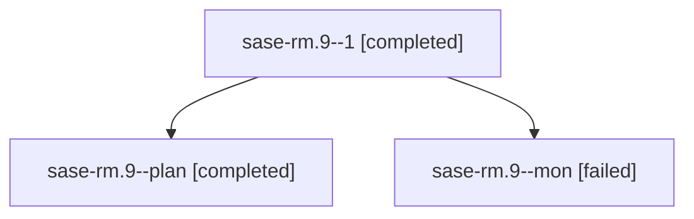

# Family: sase-rm.9

[Agent Hoods](../README.md) / [bbugyi200](../users/bbugyi200/README.md) / [athena](../users/bbugyi200/machines/athena/README.md) / [sase-rm](../users/bbugyi200/machines/athena/hoods/sase-rm/README.md) / sase-rm.9

Owner: `bbugyi200.athena` · Hood: `sase-rm` · Members: 3 · Bead: [sase-rm.9](https://github.com/sase-org/sase--beads/blob/main/pages/sase-rm/sase-rm.9.md)

## Lineage

The diagram is an optional enhancement; the ordered table below contains the same lineage in accessible text.

| Role | Agent | State | Model / provider | Timing | Commits | Prompt | Chat |
|---|---|---|---|---|---:|---|---|
| 1 | sase-rm.9--1 | completed | grok-4.6 / grok | 2026-08-20T19:22:16.721829+00:00 | [1](../agents/bbugyi200.athena.sase-rm.9--1/README.md#commits) | [Prompt](../agents/bbugyi200.athena.sase-rm.9--1/prompt.md) | [Chat](../agents/bbugyi200.athena.sase-rm.9--1/chat.md) |
| plan | sase-rm.9--plan | completed | grok-4.6 / grok | 2026-08-20T18:54:36.169586+00:00 | 0 | [Prompt](../agents/bbugyi200.athena.sase-rm.9--plan/prompt.md) | [Chat](../agents/bbugyi200.athena.sase-rm.9--plan/chat.md) |
| mon | sase-rm.9--mon | failed | grok-4.6 / grok | 2026-08-20T19:18:41.215516+00:00 | 0 | — | [Chat](../agents/bbugyi200.athena.sase-rm.9--mon/chat.md) |

## Commits

| Role | Repo | Commit | Subject | Committed |
|---|---|---|---|---|
| 1 | sase | [`dbb0511`](https://github.com/sase-org/sase/commit/dbb05112e7f9c3667e17b4d4b5a0c4399c83158d) | test(ace): wait for snippet-name modal analysis to settle | 2026-08-20 15:28:58 EDT |

## Neighbors

| Agent | Relation | State |
|---|---|---|
| [sase-rm.1](bbugyi200.athena.sase-rm.1.md) (family · 2) | sase-rm hood | completed 2 |
| [sase-rm.10](bbugyi200.athena.sase-rm.10.md) (family · 2) | sase-rm hood | active 2 |
| [sase-rm.11](bbugyi200.athena.sase-rm.11.md) (family · 2) | sase-rm hood | completed 2 |
| [sase-rm.12](../agents/bbugyi200.athena.sase-rm.12/README.md) | sase-rm hood | completed |
| [sase-rm.13](../agents/bbugyi200.athena.sase-rm.13/README.md) | sase-rm hood | waiting |
| [sase-rm.2](bbugyi200.athena.sase-rm.2.md) (family · 4) | sase-rm hood | active 2, failed 2 |
| [sase-rm.3](bbugyi200.athena.sase-rm.3.md) (family · 2) | sase-rm hood | completed 2 |
| [sase-rm.4](bbugyi200.athena.sase-rm.4.md) (family · 2) | sase-rm hood | completed 2 |
| [sase-rm.5](../agents/bbugyi200.athena.sase-rm.5/README.md) | sase-rm hood | waiting |
| [sase-rm.6](bbugyi200.athena.sase-rm.6.md) (family · 8) | sase-rm hood | active 1, completed 4, failed 3 |
| [sase-rm.6](../agents/bbugyi200.athena.sase-rm.6/README.md) | sase-rm hood | completed |
| [sase-rm.7](../agents/bbugyi200.athena.sase-rm.7/README.md) | sase-rm hood | completed |
| [sase-rm.8](../agents/bbugyi200.athena.sase-rm.8/README.md) | sase-rm hood | completed |
| [sase-rm.land](../agents/bbugyi200.athena.sase-rm.land/README.md) | sase-rm hood | waiting |
