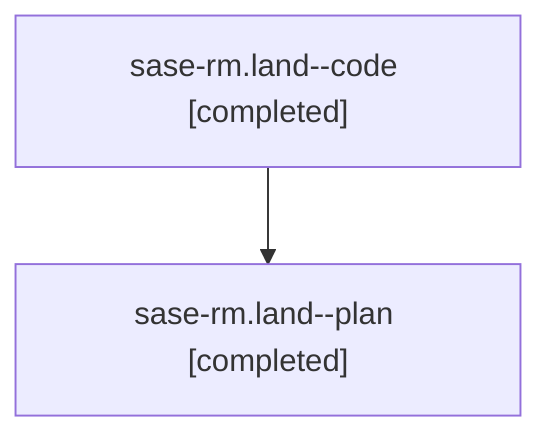

# Family: sase-rm.land

[Agent Hoods](../README.md) / [bbugyi200](../users/bbugyi200/README.md) / [athena](../users/bbugyi200/machines/athena/README.md) / [sase-rm](../users/bbugyi200/machines/athena/hoods/sase-rm/README.md) / sase-rm.land

Owner: `bbugyi200.athena` · Hood: `sase-rm` · Members: 2 · Bead: [sase-rm](https://github.com/sase-org/sase--beads/blob/main/pages/sase-rm/README.md)

## Lineage

The diagram is an optional enhancement; the ordered table below contains the same lineage in accessible text.

| Role | Agent | State | Model / provider | Timing | Commits | Prompt | Chat |
|---|---|---|---|---|---:|---|---|
| code | sase-rm.land--code | completed | grok-4.6 / grok | 2026-08-21T17:27:26.303383+00:00 → 2026-08-21T17:44:45.275024+00:00 | [1](../agents/bbugyi200.athena.sase-rm.land--code/README.md#commits) | — | [Chat](../agents/bbugyi200.athena.sase-rm.land--code/chat.md) |
| plan | sase-rm.land--plan | completed | gpt-5.6-sol / codex | 2026-08-21T16:49:55.849765+00:00 → 2026-08-21T17:44:45.275024+00:00 | [2](../agents/bbugyi200.athena.sase-rm.land--plan/README.md#commits) | [Prompt](../agents/bbugyi200.athena.sase-rm.land--plan/prompt.md) | [Chat](../agents/bbugyi200.athena.sase-rm.land--plan/chat.md) |

## Commits

| Role | Repo | Commit | Subject | Committed |
|---|---|---|---|---|
| plan | sase | [`bcb7411`](https://github.com/sase-org/sase/commit/bcb7411aca13ba9a607762f290430dd7df005108) | fix(finalizers): complete public API cleanup | 2026-08-21 13:20:36 EDT |
| plan | sase | [`5fe0587`](https://github.com/sase-org/sase/commit/5fe0587b0134d5196ab07872ff1006e504e64b04) | fix(flags): integrate saved-state facade with retired flags | 2026-08-21 13:25:40 EDT |
| code | sase | [`a1ee712`](https://github.com/sase-org/sase/commit/a1ee712381d7e5c038f576329970450a10c2c91d) | refactor(finalizers): export declaration helpers as a public API | 2026-08-21 13:43:40 EDT |

## Neighbors

| Agent | Relation | State |
|---|---|---|
| [sase-rm.1](bbugyi200.athena.sase-rm.1.md) (family · 2) | sase-rm hood | completed 2 |
| [sase-rm.10](bbugyi200.athena.sase-rm.10.md) (family · 2) | sase-rm hood | completed 2 |
| [sase-rm.11](bbugyi200.athena.sase-rm.11.md) (family · 2) | sase-rm hood | completed 2 |
| [sase-rm.12](../agents/bbugyi200.athena.sase-rm.12/README.md) | sase-rm hood | completed |
| [sase-rm.13](bbugyi200.athena.sase-rm.13.md) (family · 2) | sase-rm hood | completed 2 |
| [sase-rm.2](bbugyi200.athena.sase-rm.2.md) (family · 4) | sase-rm hood | completed 2, failed 2 |
| [sase-rm.3](bbugyi200.athena.sase-rm.3.md) (family · 2) | sase-rm hood | completed 2 |
| [sase-rm.4](bbugyi200.athena.sase-rm.4.md) (family · 2) | sase-rm hood | completed 2 |
| [sase-rm.5](bbugyi200.athena.sase-rm.5.md) (family · 2) | sase-rm hood | completed 2 |
| [sase-rm.6](bbugyi200.athena.sase-rm.6.md) (family · 8) | sase-rm hood | active 1, completed 4, failed 3 |
| [sase-rm.6](../agents/bbugyi200.athena.sase-rm.6/README.md) | sase-rm hood | completed |
| [sase-rm.7](../agents/bbugyi200.athena.sase-rm.7/README.md) | sase-rm hood | completed |
| [sase-rm.8](../agents/bbugyi200.athena.sase-rm.8/README.md) | sase-rm hood | completed |
| [sase-rm.9](bbugyi200.athena.sase-rm.9.md) (family · 3) | sase-rm hood | completed 2, failed 1 |
