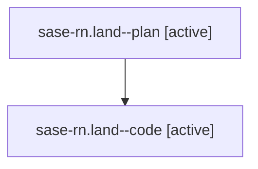

# Family: sase-rn.land

[Agent Hoods](../README.md) / [bbugyi200](../users/bbugyi200/README.md) / [athena](../users/bbugyi200/machines/athena/README.md) / [sase-rn](../users/bbugyi200/machines/athena/hoods/sase-rn/README.md) / sase-rn.land

Owner: `bbugyi200.athena` · Hood: `sase-rn` · Members: 2 · Bead: [sase-rn](https://github.com/sase-org/sase--beads/blob/main/pages/sase-rn/README.md)

## Lineage

The diagram is an optional enhancement; the ordered table below contains the same lineage in accessible text.

| Role | Agent | State | Model / provider | Timing | Commits | Prompt | Chat |
|---|---|---|---|---|---:|---|---|
| plan | sase-rn.land--plan | active | gpt-5.6-sol / codex | 2026-08-20T23:39:13.663623+00:00 | 0 | [Prompt](../agents/bbugyi200.athena.sase-rn.land--plan/prompt.md) | [Chat](../agents/bbugyi200.athena.sase-rn.land--plan/chat.md) |
| code | sase-rn.land--code | active | gemini-3.7-flash-high / agy | 2026-08-20T23:49:40.919697+00:00 | [1](../agents/bbugyi200.athena.sase-rn.land--code/README.md#commits) | — | — |

## Commits

| Role | Repo | Commit | Subject | Committed |
|---|---|---|---|---|
| code | sase | [`7c52152`](https://github.com/sase-org/sase/commit/7c52152832fbb4033f89d8d4cf0a690afbe1fbd1) | test(completion): sync cli\_spec.json snapshot with finalizer subcommands | 2026-08-20 23:53:57 UTC |

## Neighbors

| Agent | Relation | State |
|---|---|---|
| [sase-rn.1](../agents/bbugyi200.athena.sase-rn.1/README.md) | sase-rn hood | completed |
| [sase-rn.2](../agents/bbugyi200.athena.sase-rn.2/README.md) | sase-rn hood | completed |
| [sase-rn.3](../agents/bbugyi200.athena.sase-rn.3/README.md) | sase-rn hood | completed |
| [sase-rn.4](../agents/bbugyi200.athena.sase-rn.4/README.md) | sase-rn hood | completed |
| [sase-rn.5](../agents/bbugyi200.athena.sase-rn.5/README.md) | sase-rn hood | completed |
| [sase-rn.6](../agents/bbugyi200.athena.sase-rn.6/README.md) | sase-rn hood | completed |
| [sase-rn.7](../agents/bbugyi200.athena.sase-rn.7/README.md) | sase-rn hood | completed |
