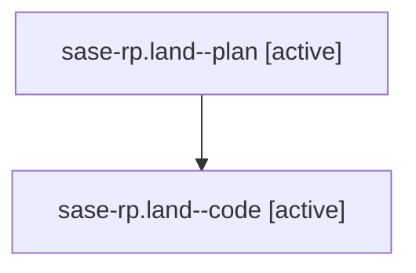

# Family: sase-rp.land

[Agent Hoods](../README.md) / [bbugyi200](../users/bbugyi200/README.md) / [athena](../users/bbugyi200/machines/athena/README.md) / [sase-rp](../users/bbugyi200/machines/athena/hoods/sase-rp/README.md) / sase-rp.land

Owner: `bbugyi200.athena` · Hood: `sase-rp` · Members: 2 · Bead: [sase-rp](https://github.com/sase-org/sase--beads/blob/main/pages/sase-rp/README.md)

## Lineage

The diagram is an optional enhancement; the ordered table below contains the same lineage in accessible text.

| Role | Agent | State | Model / provider | Timing | Commits | Prompt | Chat |
|---|---|---|---|---|---:|---|---|
| plan | sase-rp.land--plan | active | gpt-5.6-sol / codex | 2026-08-21T12:22:02.120792+00:00 | 0 | [Prompt](../agents/bbugyi200.athena.sase-rp.land--plan/prompt.md) | [Chat](../agents/bbugyi200.athena.sase-rp.land--plan/chat.md) |
| code | sase-rp.land--code | active | gpt-5.5 / codex | 2026-08-21T12:41:34.955977+00:00 | [1](../agents/bbugyi200.athena.sase-rp.land--code/README.md#commits) | — | — |

## Commits

| Role | Repo | Commit | Subject | Committed |
|---|---|---|---|---|
| code | sase | [`3e0bebe`](https://github.com/sase-org/sase/commit/3e0bebedd26e1be97ce3b07f0ac89f1ffd3fa4eb) | fix: dedupe embedded launch refresh callbacks | 2026-08-21 12:54:48 UTC |

## Neighbors

| Agent | Relation | State |
|---|---|---|
| [sase-rp.1](../agents/bbugyi200.athena.sase-rp.1/README.md) | sase-rp hood | completed |
| [sase-rp.2](../agents/bbugyi200.athena.sase-rp.2/README.md) | sase-rp hood | completed |
| [sase-rp.3](../agents/bbugyi200.athena.sase-rp.3/README.md) | sase-rp hood | completed |
