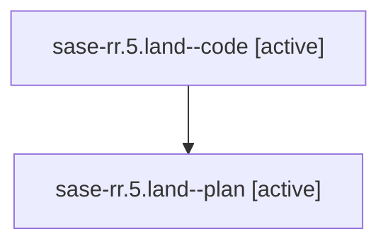

# Family: sase-rr.5.land

[Agent Hoods](../README.md) / [bbugyi200](../users/bbugyi200/README.md) / [athena](../users/bbugyi200/machines/athena/README.md) / [sase-rr](../users/bbugyi200/machines/athena/hoods/sase-rr/README.md) / sase-rr.5.land

Owner: `bbugyi200.athena` · Hood: `sase-rr` · Members: 2 · Bead: [sase-rr.5](https://github.com/sase-org/sase--beads/blob/main/pages/sase-rr/sase-rr.5.md)

## Lineage

The diagram is an optional enhancement; the ordered table below contains the same lineage in accessible text.

| Role | Agent | State | Model / provider | Timing | Commits | Prompt | Chat |
|---|---|---|---|---|---:|---|---|
| code | sase-rr.5.land--code | active | grok-4.6 / grok | 2026-08-21T23:28:16.027258+00:00 | [1](../agents/bbugyi200.athena.sase-rr.5.land--code/README.md#commits) | — | — |
| plan | sase-rr.5.land--plan | active | gpt-5.6-sol / codex | 2026-08-21T23:11:34.654560+00:00 | 0 | [Prompt](../agents/bbugyi200.athena.sase-rr.5.land--plan/prompt.md) | [Chat](../agents/bbugyi200.athena.sase-rr.5.land--plan/chat.md) |

## Commits

| Role | Repo | Commit | Subject | Committed |
|---|---|---|---|---|
| code | sase | [`959a547`](https://github.com/sase-org/sase/commit/959a547709e7ed6a400494ed57a2009749ad4cdb) | test(release): keep ledger invariants off the core-floor contract set | 2026-08-21 23:44:58 UTC |

## Neighbors

| Agent | Relation | State |
|---|---|---|
| [sase-rr.5.1](../agents/bbugyi200.athena.sase-rr.5.1/README.md) | sase-rr.5 hood | completed |
| [sase-rr.5.2](../agents/bbugyi200.athena.sase-rr.5.2/README.md) | sase-rr.5 hood | completed |
| [sase-rr.5.3](../agents/bbugyi200.athena.sase-rr.5.3/README.md) | sase-rr.5 hood | completed |
| [sase-rr.5.4](../agents/bbugyi200.athena.sase-rr.5.4/README.md) | sase-rr.5 hood | completed |
| [sase-rr.5.5](../agents/bbugyi200.athena.sase-rr.5.5/README.md) | sase-rr.5 hood | completed |
| [sase-rr.1](../agents/bbugyi200.athena.sase-rr.1/README.md) | sase-rr hood | completed |
| [sase-rr.2](../agents/bbugyi200.athena.sase-rr.2/README.md) | sase-rr hood | dismissed |
| [sase-rr.3](../agents/bbugyi200.athena.sase-rr.3/README.md) | sase-rr hood | completed |
| [sase-rr.4](../agents/bbugyi200.athena.sase-rr.4/README.md) | sase-rr hood | completed |
| [sase-rr.land](bbugyi200.athena.sase-rr.land.md) (family · 6) | sase-rr hood | completed 2, failed 4 |
| [sase-rr.land.w1](bbugyi200.athena.sase-rr.land.w1.md) (family · 2) | sase-rr hood | failed 2 |
