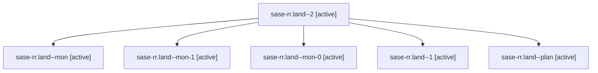

# Family: sase-rr.land

[Agent Hoods](../README.md) / [bbugyi200](../users/bbugyi200/README.md) / [athena](../users/bbugyi200/machines/athena/README.md) / [sase-rr](../users/bbugyi200/machines/athena/hoods/sase-rr/README.md) / sase-rr.land

Owner: `bbugyi200.athena` · Hood: `sase-rr` · Members: 6 · Bead: [sase-rr](https://github.com/sase-org/sase--beads/blob/main/pages/sase-rr/README.md)

## Lineage

The diagram is an optional enhancement; the ordered table below contains the same lineage in accessible text.

| Role | Agent | State | Model / provider | Timing | Commits | Prompt | Chat |
|---|---|---|---|---|---:|---|---|
| 2 | sase-rr.land--2 | active | gpt-5.6-sol / codex | 2026-08-21T20:19:14.846289+00:00 | 0 | [Prompt](../agents/bbugyi200.athena.sase-rr.land--2/prompt.md) | [Chat](../agents/bbugyi200.athena.sase-rr.land--2/chat.md) |
| mon | sase-rr.land--mon | active | gpt-5.6-sol / codex | 2026-08-21T19:42:18.757753+00:00 | 0 | — | — |
| mon-1 | sase-rr.land--mon-1 | active | gpt-5.6-sol / codex | 2026-08-21T20:27:08.053918+00:00 | 0 | — | — |
| mon-0 | sase-rr.land--mon-0 | active | gpt-5.6-sol / codex | 2026-08-21T19:56:37.270977+00:00 | 0 | — | — |
| 1 | sase-rr.land--1 | active | gpt-5.6-sol / codex | 2026-08-21T19:48:55.460804+00:00 | 0 | [Prompt](../agents/bbugyi200.athena.sase-rr.land--1/prompt.md) | [Chat](../agents/bbugyi200.athena.sase-rr.land--1/chat.md) |
| plan | sase-rr.land--plan | active | gpt-5.6-sol / codex | 2026-08-21T19:30:42.553683+00:00 | 0 | [Prompt](../agents/bbugyi200.athena.sase-rr.land--plan/prompt.md) | [Chat](../agents/bbugyi200.athena.sase-rr.land--plan/chat.md) |

## Neighbors

| Agent | Relation | State |
|---|---|---|
| [sase-rr.land.w1](bbugyi200.athena.sase-rr.land.w1.md) (family · 2) | descendant | active 1, failed 1 |
| [sase-rr.1](../agents/bbugyi200.athena.sase-rr.1/README.md) | sase-rr hood | active |
| [sase-rr.2](../agents/bbugyi200.athena.sase-rr.2/README.md) | sase-rr hood | active |
| [sase-rr.3](../agents/bbugyi200.athena.sase-rr.3/README.md) | sase-rr hood | active |
| [sase-rr.4](../agents/bbugyi200.athena.sase-rr.4/README.md) | sase-rr hood | active |
| [sase-rr.5.1](../agents/bbugyi200.athena.sase-rr.5.1/README.md) | sase-rr hood | active |
| [sase-rr.5.2](../agents/bbugyi200.athena.sase-rr.5.2/README.md) | sase-rr hood | active |
| [sase-rr.5.3](../agents/bbugyi200.athena.sase-rr.5.3/README.md) | sase-rr hood | active |
| [sase-rr.5.4](../agents/bbugyi200.athena.sase-rr.5.4/README.md) | sase-rr hood | active |
| [sase-rr.5.5](../agents/bbugyi200.athena.sase-rr.5.5/README.md) | sase-rr hood | active |
| [sase-rr.5.land](bbugyi200.athena.sase-rr.5.land.md) (family · 2) | sase-rr hood | active 1, completed 1 |
