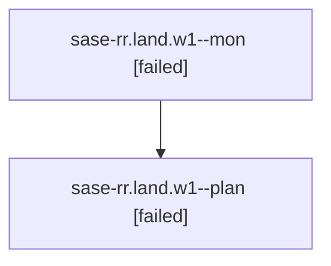

# Family: sase-rr.land.w1

[Agent Hoods](../README.md) / [bbugyi200](../users/bbugyi200/README.md) / [athena](../users/bbugyi200/machines/athena/README.md) / [sase-rr](../users/bbugyi200/machines/athena/hoods/sase-rr/README.md) / sase-rr.land.w1

Owner: `bbugyi200.athena` · Hood: `sase-rr` · Members: 2

## Lineage

The diagram is an optional enhancement; the ordered table below contains the same lineage in accessible text.

| Role | Agent | State | Model / provider | Timing | Commits | Prompt | Chat |
|---|---|---|---|---|---:|---|---|
| mon | sase-rr.land.w1--mon | failed | gpt-5.6-sol / codex | 2026-08-21T20:34:54.166639+00:00 | 0 | — | [Chat](../agents/bbugyi200.athena.sase-rr.land.w1--mon/chat.md) |
| plan | sase-rr.land.w1--plan | failed | gpt-5.6-sol / codex | 2026-08-21T20:19:17.542172+00:00 → 2026-08-21T20:34:43.225200+00:00 | 0 | [Prompt](../agents/bbugyi200.athena.sase-rr.land.w1--plan/prompt.md) | [Chat](../agents/bbugyi200.athena.sase-rr.land.w1--plan/chat.md) |

## Neighbors

| Agent | Relation | State |
|---|---|---|
| [sase-rr.land](bbugyi200.athena.sase-rr.land.md) (family · 6) | ancestor | completed 2, failed 4 |
| [sase-rr.1](../agents/bbugyi200.athena.sase-rr.1/README.md) | sase-rr hood | completed |
| [sase-rr.2](../agents/bbugyi200.athena.sase-rr.2/README.md) | sase-rr hood | dismissed |
| [sase-rr.3](../agents/bbugyi200.athena.sase-rr.3/README.md) | sase-rr hood | completed |
| [sase-rr.4](../agents/bbugyi200.athena.sase-rr.4/README.md) | sase-rr hood | completed |
| [sase-rr.5.1](../agents/bbugyi200.athena.sase-rr.5.1/README.md) | sase-rr hood | completed |
| [sase-rr.5.2](../agents/bbugyi200.athena.sase-rr.5.2/README.md) | sase-rr hood | completed |
| [sase-rr.5.3](../agents/bbugyi200.athena.sase-rr.5.3/README.md) | sase-rr hood | completed |
| [sase-rr.5.4](../agents/bbugyi200.athena.sase-rr.5.4/README.md) | sase-rr hood | completed |
| [sase-rr.5.5](../agents/bbugyi200.athena.sase-rr.5.5/README.md) | sase-rr hood | completed |
| [sase-rr.5.land](bbugyi200.athena.sase-rr.5.land.md) (family · 2) | sase-rr hood | active 2 |
