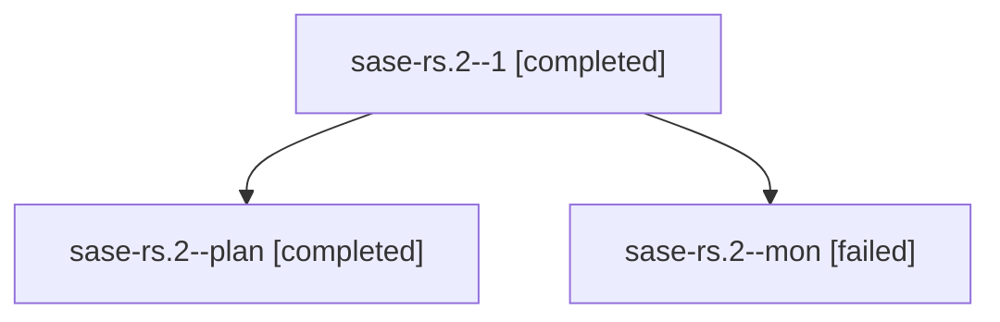

# Family: sase-rs.2

[Agent Hoods](../README.md) / [bbugyi200](../users/bbugyi200/README.md) / [athena](../users/bbugyi200/machines/athena/README.md) / [sase-rs](../users/bbugyi200/machines/athena/hoods/sase-rs/README.md) / sase-rs.2

Owner: `bbugyi200.athena` · Hood: `sase-rs` · Members: 3 · Bead: [sase-rs.2](https://github.com/sase-org/sase--beads/blob/main/pages/sase-rs/sase-rs.2.md)

## Lineage

The diagram is an optional enhancement; the ordered table below contains the same lineage in accessible text.

| Role | Agent | State | Model / provider | Timing | Commits | Prompt | Chat |
|---|---|---|---|---|---:|---|---|
| 1 | sase-rs.2--1 | completed | grok-4.6 / grok | 2026-08-21T15:28:54.063212+00:00 | [1](../agents/bbugyi200.athena.sase-rs.2--1/README.md#commits) | [Prompt](../agents/bbugyi200.athena.sase-rs.2--1/prompt.md) | [Chat](../agents/bbugyi200.athena.sase-rs.2--1/chat.md) |
| plan | sase-rs.2--plan | completed | grok-4.6 / grok | 2026-08-21T14:37:56.045655+00:00 | 0 | [Prompt](../agents/bbugyi200.athena.sase-rs.2--plan/prompt.md) | [Chat](../agents/bbugyi200.athena.sase-rs.2--plan/chat.md) |
| mon | sase-rs.2--mon | failed | grok-4.6 / grok | 2026-08-21T15:16:45.669724+00:00 | 0 | — | [Chat](../agents/bbugyi200.athena.sase-rs.2--mon/chat.md) |

## Commits

| Role | Repo | Commit | Subject | Committed |
|---|---|---|---|---|
| 1 | sase | [`f355faa`](https://github.com/sase-org/sase/commit/f355faa969513ae0bf09d27423240c3d0f167e03) | build(deps): raise sase-core-rs floor to 0.29.6 | 2026-08-21 11:48:29 EDT |

## Neighbors

| Agent | Relation | State |
|---|---|---|
| [sase-rs.1](../agents/bbugyi200.athena.sase-rs.1/README.md) | sase-rs hood | completed |
| [sase-rs.3](../agents/bbugyi200.athena.sase-rs.3/README.md) | sase-rs hood | active |
| [sase-rs.4](../agents/bbugyi200.athena.sase-rs.4/README.md) | sase-rs hood | waiting |
| [sase-rs.5](../agents/bbugyi200.athena.sase-rs.5/README.md) | sase-rs hood | waiting |
| [sase-rs.6](../agents/bbugyi200.athena.sase-rs.6/README.md) | sase-rs hood | waiting |
| [sase-rs.land](../agents/bbugyi200.athena.sase-rs.land/README.md) | sase-rs hood | waiting |
