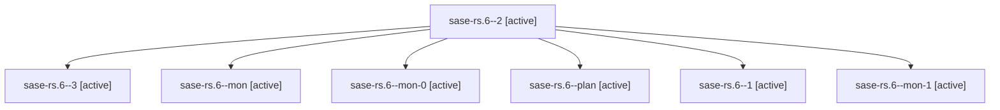

# Family: sase-rs.6

[Agent Hoods](../README.md) / [bbugyi200](../users/bbugyi200/README.md) / [athena](../users/bbugyi200/machines/athena/README.md) / [sase-rs](../users/bbugyi200/machines/athena/hoods/sase-rs/README.md) / sase-rs.6

Owner: `bbugyi200.athena` · Hood: `sase-rs` · Members: 7 · Bead: [sase-rs.6](https://github.com/sase-org/sase--beads/blob/main/pages/sase-rs/sase-rs.6.md)

## Lineage

The diagram is an optional enhancement; the ordered table below contains the same lineage in accessible text.

| Role | Agent | State | Model / provider | Timing | Commits | Prompt | Chat |
|---|---|---|---|---|---:|---|---|
| 2 | sase-rs.6--2 | active | grok-4.6 / grok | 2026-08-21T19:02:04.778180+00:00 | 0 | [Prompt](../agents/bbugyi200.athena.sase-rs.6--2/prompt.md) | [Chat](../agents/bbugyi200.athena.sase-rs.6--2/chat.md) |
| 3 | sase-rs.6--3 | active | grok-4.6 / grok | 2026-08-21T19:12:08.200800+00:00 | 0 | [Prompt](../agents/bbugyi200.athena.sase-rs.6--3/prompt.md) | — |
| mon | sase-rs.6--mon | active | grok-4.6 / grok | 2026-08-21T18:39:12.035122+00:00 | 0 | — | — |
| mon-0 | sase-rs.6--mon-0 | active | grok-4.6 / grok | 2026-08-21T18:46:06.175605+00:00 | 0 | — | — |
| plan | sase-rs.6--plan | active | grok-4.6 / grok | 2026-08-21T17:59:30.074532+00:00 | 0 | [Prompt](../agents/bbugyi200.athena.sase-rs.6--plan/prompt.md) | [Chat](../agents/bbugyi200.athena.sase-rs.6--plan/chat.md) |
| 1 | sase-rs.6--1 | active | grok-4.6 / grok | 2026-08-21T18:41:25.094080+00:00 | 0 | [Prompt](../agents/bbugyi200.athena.sase-rs.6--1/prompt.md) | [Chat](../agents/bbugyi200.athena.sase-rs.6--1/chat.md) |
| mon-1 | sase-rs.6--mon-1 | active | grok-4.6 / grok | 2026-08-21T19:08:35.868255+00:00 | 0 | — | — |

## Commits

| Role | Repo | Commit | Subject | Committed |
|---|---|---|---|---|
| — | sase | [`48f1365`](https://github.com/sase-org/sase/commit/48f1365d3ae94ae21226a8e8203a6efdf89a2e3e) | feat(flags): polish Config Flags docs, journeys, and chrome goldens | 2026-08-21 15:25:34 EDT |

## Neighbors

| Agent | Relation | State |
|---|---|---|
| [sase-rs.1](../agents/bbugyi200.athena.sase-rs.1/README.md) | sase-rs hood | active |
| [sase-rs.2](bbugyi200.athena.sase-rs.2.md) (family · 3) | sase-rs hood | active 3 |
| [sase-rs.3](../agents/bbugyi200.athena.sase-rs.3/README.md) | sase-rs hood | active |
| [sase-rs.4](../agents/bbugyi200.athena.sase-rs.4/README.md) | sase-rs hood | active |
| [sase-rs.5](../agents/bbugyi200.athena.sase-rs.5/README.md) | sase-rs hood | active |
| [sase-rs.land](../agents/bbugyi200.athena.sase-rs.land/README.md) | sase-rs hood | active |
