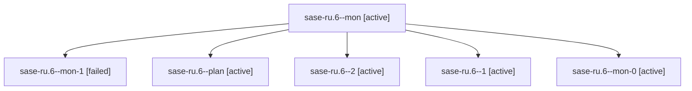

# Family: sase-ru.6

[Agent Hoods](../README.md) / [bbugyi200](../users/bbugyi200/README.md) / [athena](../users/bbugyi200/machines/athena/README.md) / [sase-ru](../users/bbugyi200/machines/athena/hoods/sase-ru/README.md) / sase-ru.6

Owner: `bbugyi200.athena` · Hood: `sase-ru` · Members: 6 · Bead: [sase-ru.6](https://github.com/sase-org/sase--beads/blob/main/pages/sase-ru/sase-ru.6.md)

## Lineage

The diagram is an optional enhancement; the ordered table below contains the same lineage in accessible text.

| Role | Agent | State | Model / provider | Timing | Commits | Prompt | Chat |
|---|---|---|---|---|---:|---|---|
| mon | sase-ru.6--mon | active | grok-4.6 / grok | 2026-08-21T16:36:43.619326+00:00 | 0 | — | — |
| mon-1 | sase-ru.6--mon-1 | failed | grok-4.6 / grok | 2026-08-22T04:45:09.796670+00:00 | 0 | — | [Chat](../agents/bbugyi200.athena.sase-ru.6--mon-1/chat.md) |
| plan | sase-ru.6--plan | active | grok-4.6 / grok | 2026-08-21T16:21:45.430146+00:00 | 0 | [Prompt](../agents/bbugyi200.athena.sase-ru.6--plan/prompt.md) | [Chat](../agents/bbugyi200.athena.sase-ru.6--plan/chat.md) |
| 2 | sase-ru.6--2 | active | grok-4.6 / grok | 2026-08-22T04:41:22.004996+00:00 | 0 | [Prompt](../agents/bbugyi200.athena.sase-ru.6--2/prompt.md) | [Chat](../agents/bbugyi200.athena.sase-ru.6--2/chat.md) |
| 1 | sase-ru.6--1 | active | grok-4.6 / grok | 2026-08-22T04:37:08.762838+00:00 | 0 | [Prompt](../agents/bbugyi200.athena.sase-ru.6--1/prompt.md) | [Chat](../agents/bbugyi200.athena.sase-ru.6--1/chat.md) |
| mon-0 | sase-ru.6--mon-0 | active | grok-4.6 / grok | 2026-08-22T04:40:48.506627+00:00 | 0 | — | — |

## Neighbors

| Agent | Relation | State |
|---|---|---|
| [sase-ru.1](bbugyi200.athena.sase-ru.1.md) (family · 5) | sase-ru hood | active 5 |
| [sase-ru.10](../agents/bbugyi200.athena.sase-ru.10/README.md) | sase-ru hood | active |
| [sase-ru.11](../agents/bbugyi200.athena.sase-ru.11/README.md) | sase-ru hood | waiting |
| [sase-ru.12](../agents/bbugyi200.athena.sase-ru.12/README.md) | sase-ru hood | waiting |
| [sase-ru.2](../agents/bbugyi200.athena.sase-ru.2/README.md) | sase-ru hood | active |
| [sase-ru.3](../agents/bbugyi200.athena.sase-ru.3/README.md) | sase-ru hood | active |
| [sase-ru.4](../agents/bbugyi200.athena.sase-ru.4/README.md) | sase-ru hood | active |
| [sase-ru.5](../agents/bbugyi200.athena.sase-ru.5/README.md) | sase-ru hood | active |
| [sase-ru.7](../agents/bbugyi200.athena.sase-ru.7/README.md) | sase-ru hood | active |
| [sase-ru.8](../agents/bbugyi200.athena.sase-ru.8/README.md) | sase-ru hood | active |
| [sase-ru.9](../agents/bbugyi200.athena.sase-ru.9/README.md) | sase-ru hood | active |
| [sase-ru.land](../agents/bbugyi200.athena.sase-ru.land/README.md) | sase-ru hood | waiting |
