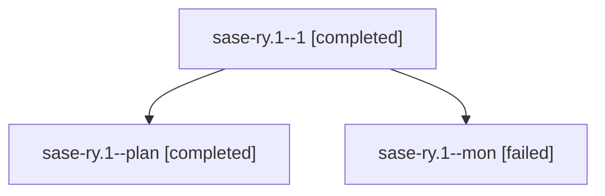

# Family: sase-ry.1

[Agent Hoods](../README.md) / [bbugyi200](../users/bbugyi200/README.md) / [athena](../users/bbugyi200/machines/athena/README.md) / [sase-ry](../users/bbugyi200/machines/athena/hoods/sase-ry/README.md) / sase-ry.1

Owner: `bbugyi200.athena` · Hood: `sase-ry` · Members: 3 · Bead: [sase-ry.1](https://github.com/sase-org/sase--beads/blob/main/pages/sase-ry/sase-ry.1.md)

## Lineage

The diagram is an optional enhancement; the ordered table below contains the same lineage in accessible text.

| Role | Agent | State | Model / provider | Timing | Commits | Prompt | Chat |
|---|---|---|---|---|---:|---|---|
| 1 | sase-ry.1--1 | completed | gpt-5.5 / codex | 2026-08-21T19:16:35.401581+00:00 → 2026-08-21T19:20:53.869704+00:00 | 0 | [Prompt](../agents/bbugyi200.athena.sase-ry.1--1/prompt.md) | [Chat](../agents/bbugyi200.athena.sase-ry.1--1/chat.md) |
| plan | sase-ry.1--plan | completed | gpt-5.5 / codex | 2026-08-21T18:57:38.049163+00:00 → 2026-08-21T19:15:51.673877+00:00 | [1](../agents/bbugyi200.athena.sase-ry.1--plan/README.md#commits) | [Prompt](../agents/bbugyi200.athena.sase-ry.1--plan/prompt.md) | [Chat](../agents/bbugyi200.athena.sase-ry.1--plan/chat.md) |
| mon | sase-ry.1--mon | failed | gpt-5.5 / codex | 2026-08-21T19:15:09.250708+00:00 | 0 | — | [Chat](../agents/bbugyi200.athena.sase-ry.1--mon/chat.md) |

## Commits

| Role | Repo | Commit | Subject | Committed |
|---|---|---|---|---|
| plan | sase | [`c83926b`](https://github.com/sase-org/sase/commit/c83926b522afbcc305aee6f14503255fa61e192f) | ci: install just in release core floor smoke | 2026-08-21 19:10:53 UTC |

## Neighbors

| Agent | Relation | State |
|---|---|---|
| [sase-ry.2](bbugyi200.athena.sase-ry.2.md) (family · 6) | sase-ry hood | completed 2, failed 4 |
| [sase-ry.2--2--code](../agents/bbugyi200.athena.sase-ry.2--2--code/README.md) | sase-ry hood | active |
| [sase-ry.2--2--mon](../agents/bbugyi200.athena.sase-ry.2--2--mon/README.md) | sase-ry hood | failed |
| [sase-ry.2--2--plan](../agents/bbugyi200.athena.sase-ry.2--2--plan/README.md) | sase-ry hood | active |
| [sase-ry.3](../agents/bbugyi200.athena.sase-ry.3/README.md) | sase-ry hood | waiting |
| [sase-ry.4](../agents/bbugyi200.athena.sase-ry.4/README.md) | sase-ry hood | waiting |
| [sase-ry.land](../agents/bbugyi200.athena.sase-ry.land/README.md) | sase-ry hood | waiting |
