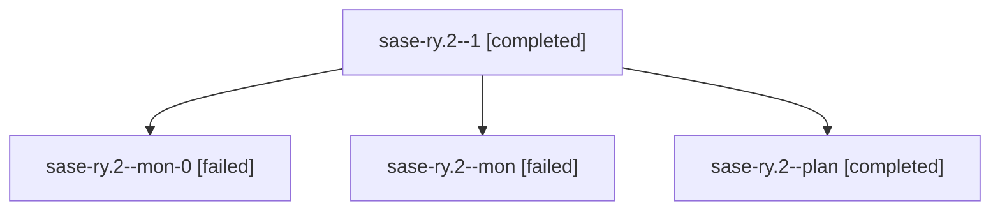

# Family: sase-ry.2

[Agent Hoods](../README.md) / [bbugyi200](../users/bbugyi200/README.md) / [athena](../users/bbugyi200/machines/athena/README.md) / [sase-ry](../users/bbugyi200/machines/athena/hoods/sase-ry/README.md) / sase-ry.2

Owner: `bbugyi200.athena` · Hood: `sase-ry` · Members: 4 · Bead: [sase-ry.2](https://github.com/sase-org/sase--beads/blob/main/pages/sase-ry/sase-ry.2.md)

## Lineage

The diagram is an optional enhancement; the ordered table below contains the same lineage in accessible text.

| Role | Agent | State | Model / provider | Timing | Commits | Prompt | Chat |
|---|---|---|---|---|---:|---|---|
| 1 | sase-ry.2--1 | completed | grok-4.6 / grok | 2026-08-21T20:25:49.923497+00:00 → 2026-08-21T20:33:19.569690+00:00 | 0 | [Prompt](../agents/bbugyi200.athena.sase-ry.2--1/prompt.md) | [Chat](../agents/bbugyi200.athena.sase-ry.2--1/chat.md) |
| mon-0 | sase-ry.2--mon-0 | failed | grok-4.6 / grok | 2026-08-21T20:32:56.080630+00:00 | 0 | — | [Chat](../agents/bbugyi200.athena.sase-ry.2--mon-0/chat.md) |
| mon | sase-ry.2--mon | failed | grok-4.6 / grok | 2026-08-21T19:30:03.547139+00:00 | 0 | — | [Chat](../agents/bbugyi200.athena.sase-ry.2--mon/chat.md) |
| plan | sase-ry.2--plan | completed | grok-4.6 / grok | 2026-08-21T19:20:23.087807+00:00 → 2026-08-21T19:30:12.785230+00:00 | 0 | [Prompt](../agents/bbugyi200.athena.sase-ry.2--plan/prompt.md) | [Chat](../agents/bbugyi200.athena.sase-ry.2--plan/chat.md) |

## Neighbors

| Agent | Relation | State |
|---|---|---|
| [sase-ry.1](bbugyi200.athena.sase-ry.1.md) (family · 3) | sase-ry hood | completed 2, failed 1 |
| [sase-ry.1](../agents/bbugyi200.athena.sase-ry.1/README.md) | sase-ry hood | completed |
| [sase-ry.2--2--code](../agents/bbugyi200.athena.sase-ry.2--2--code/README.md) | sase-ry hood | active |
| [sase-ry.2--2--plan](../agents/bbugyi200.athena.sase-ry.2--2--plan/README.md) | sase-ry hood | active |
| [sase-ry.3](../agents/bbugyi200.athena.sase-ry.3/README.md) | sase-ry hood | waiting |
| [sase-ry.4](../agents/bbugyi200.athena.sase-ry.4/README.md) | sase-ry hood | waiting |
| [sase-ry.land](../agents/bbugyi200.athena.sase-ry.land/README.md) | sase-ry hood | waiting |
