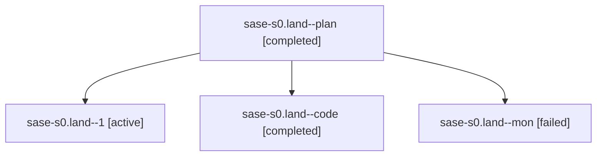

# Family: sase-s0.land

[Agent Hoods](../README.md) / [bbugyi200](../users/bbugyi200/README.md) / [athena](../users/bbugyi200/machines/athena/README.md) / [sase-s0](../users/bbugyi200/machines/athena/hoods/sase-s0/README.md) / sase-s0.land

Owner: `bbugyi200.athena` · Hood: `sase-s0` · Members: 4 · Bead: [sase-s0](https://github.com/sase-org/sase--beads/blob/main/pages/sase-s0/README.md)

## Lineage

The diagram is an optional enhancement; the ordered table below contains the same lineage in accessible text.

| Role | Agent | State | Model / provider | Timing | Commits | Prompt | Chat |
|---|---|---|---|---|---:|---|---|
| plan | sase-s0.land--plan | completed | gpt-5.6-sol / codex | 2026-08-21T22:15:57.459802+00:00 → 2026-08-21T23:03:11.515502+00:00 | 0 | [Prompt](../agents/bbugyi200.athena.sase-s0.land--plan/prompt.md) | [Chat](../agents/bbugyi200.athena.sase-s0.land--plan/chat.md) |
| 1 | sase-s0.land--1 | active | grok-4.6 / grok | 2026-08-21T23:03:46.227117+00:00 | 0 | [Prompt](../agents/bbugyi200.athena.sase-s0.land--1/prompt.md) | — |
| code | sase-s0.land--code | completed | grok-4.6 / grok | 2026-08-21T22:26:55.234738+00:00 → 2026-08-21T23:03:11.515502+00:00 | 0 | — | [Chat](../agents/bbugyi200.athena.sase-s0.land--code/chat.md) |
| mon | sase-s0.land--mon | failed | grok-4.6 / grok | 2026-08-21T23:02:55.343974+00:00 | 0 | — | [Chat](../agents/bbugyi200.athena.sase-s0.land--mon/chat.md) |

## Neighbors

| Agent | Relation | State |
|---|---|---|
| [sase-s0.1](../agents/bbugyi200.athena.sase-s0.1/README.md) | sase-s0 hood | completed |
| [sase-s0.2](../agents/bbugyi200.athena.sase-s0.2/README.md) | sase-s0 hood | completed |
| [sase-s0.3](../agents/bbugyi200.athena.sase-s0.3/README.md) | sase-s0 hood | completed |
