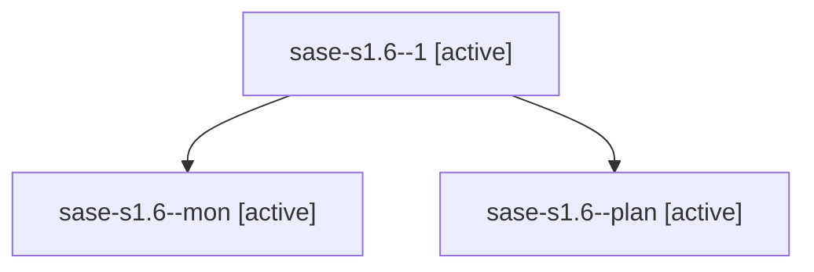

# Family: sase-s1.6

[Agent Hoods](../README.md) / [bbugyi200](../users/bbugyi200/README.md) / [athena](../users/bbugyi200/machines/athena/README.md) / [sase-s1](../users/bbugyi200/machines/athena/hoods/sase-s1/README.md) / sase-s1.6

Owner: `bbugyi200.athena` · Hood: `sase-s1` · Members: 3 · Bead: [sase-s1.6](https://github.com/sase-org/sase--beads/blob/main/pages/sase-s1/sase-s1.6.md)

## Lineage

The diagram is an optional enhancement; the ordered table below contains the same lineage in accessible text.

| Role | Agent | State | Model / provider | Timing | Commits | Prompt | Chat |
|---|---|---|---|---|---:|---|---|
| 1 | sase-s1.6--1 | active | grok-4.6 / grok | 2026-08-22T14:23:43.291314+00:00 | 0 | [Prompt](../agents/bbugyi200.athena.sase-s1.6--1/prompt.md) | — |
| mon | sase-s1.6--mon | active | grok-4.6 / grok | 2026-08-22T13:58:18.877081+00:00 | 0 | — | — |
| plan | sase-s1.6--plan | active | grok-4.6 / grok | 2026-08-22T13:34:16.774055+00:00 | 0 | [Prompt](../agents/bbugyi200.athena.sase-s1.6--plan/prompt.md) | [Chat](../agents/bbugyi200.athena.sase-s1.6--plan/chat.md) |

## Neighbors

| Agent | Relation | State |
|---|---|---|
| [sase-s1.1](../agents/bbugyi200.athena.sase-s1.1/README.md) | sase-s1 hood | active |
| [sase-s1.2](../agents/bbugyi200.athena.sase-s1.2/README.md) | sase-s1 hood | active |
| [sase-s1.3](bbugyi200.athena.sase-s1.3.md) (family · 3) | sase-s1 hood | active 3 |
| [sase-s1.4](../agents/bbugyi200.athena.sase-s1.4/README.md) | sase-s1 hood | active |
| [sase-s1.5](../agents/bbugyi200.athena.sase-s1.5/README.md) | sase-s1 hood | active |
| [sase-s1.land](../agents/bbugyi200.athena.sase-s1.land/README.md) | sase-s1 hood | active |
