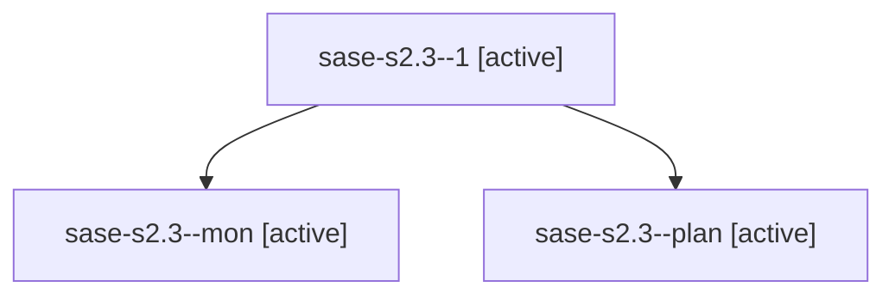

# Family: sase-s2.3

[Agent Hoods](../README.md) / [bbugyi200](../users/bbugyi200/README.md) / [athena](../users/bbugyi200/machines/athena/README.md) / [sase-s2](../users/bbugyi200/machines/athena/hoods/sase-s2/README.md) / sase-s2.3

Owner: `bbugyi200.athena` · Hood: `sase-s2` · Members: 3 · Bead: [sase-s2.3](https://github.com/sase-org/sase--beads/blob/main/pages/sase-s2/sase-s2.3.md)

## Lineage

The diagram is an optional enhancement; the ordered table below contains the same lineage in accessible text.

| Role | Agent | State | Model / provider | Timing | Commits | Prompt | Chat |
|---|---|---|---|---|---:|---|---|
| 1 | sase-s2.3--1 | active | grok-4.6 / grok | 2026-08-22T15:06:04.915918+00:00 | [1](../agents/bbugyi200.athena.sase-s2.3--1/README.md#commits) | [Prompt](../agents/bbugyi200.athena.sase-s2.3--1/prompt.md) | — |
| mon | sase-s2.3--mon | active | grok-4.6 / grok | 2026-08-22T14:44:05.574618+00:00 | 0 | — | — |
| plan | sase-s2.3--plan | active | grok-4.6 / grok | 2026-08-22T13:51:49.143484+00:00 | 0 | [Prompt](../agents/bbugyi200.athena.sase-s2.3--plan/prompt.md) | [Chat](../agents/bbugyi200.athena.sase-s2.3--plan/chat.md) |

## Commits

| Role | Repo | Commit | Subject | Committed |
|---|---|---|---|---|
| 1 | sase | [`62538c4`](https://github.com/sase-org/sase/commit/62538c4b0c5fbe8bafb786e0e51e52b3f086975e) | test(plan): prove combined approval-to-launch lifecycle (sase-s2.3) | 2026-08-22 11:10:43 EDT |

## Neighbors

| Agent | Relation | State |
|---|---|---|
| [sase-s2.1](../agents/bbugyi200.athena.sase-s2.1/README.md) | sase-s2 hood | active |
| [sase-s2.2](../agents/bbugyi200.athena.sase-s2.2/README.md) | sase-s2 hood | active |
| [sase-s2.land](bbugyi200.athena.sase-s2.land.md) (family · 3) | sase-s2 hood | active 3 |
