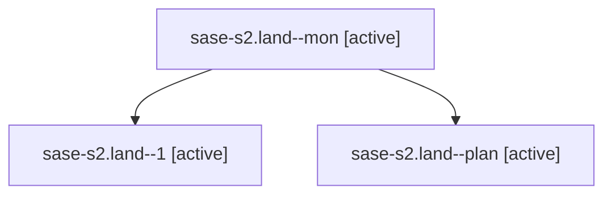

# Family: sase-s2.land

[Agent Hoods](../README.md) / [bbugyi200](../users/bbugyi200/README.md) / [athena](../users/bbugyi200/machines/athena/README.md) / [sase-s2](../users/bbugyi200/machines/athena/hoods/sase-s2/README.md) / sase-s2.land

Owner: `bbugyi200.athena` · Hood: `sase-s2` · Members: 3 · Bead: [sase-s2](https://github.com/sase-org/sase--beads/blob/main/pages/sase-s2/README.md)

## Lineage

The diagram is an optional enhancement; the ordered table below contains the same lineage in accessible text.

| Role | Agent | State | Model / provider | Timing | Commits | Prompt | Chat |
|---|---|---|---|---|---:|---|---|
| mon | sase-s2.land--mon | active | gpt-5.6-sol / codex | 2026-08-22T15:27:27.275511+00:00 | 0 | — | — |
| 1 | sase-s2.land--1 | active | gpt-5.6-sol / codex | 2026-08-22T15:47:04.690020+00:00 | 0 | [Prompt](../agents/bbugyi200.athena.sase-s2.land--1/prompt.md) | — |
| plan | sase-s2.land--plan | active | gpt-5.6-sol / codex | 2026-08-22T15:11:43.555000+00:00 | 0 | [Prompt](../agents/bbugyi200.athena.sase-s2.land--plan/prompt.md) | [Chat](../agents/bbugyi200.athena.sase-s2.land--plan/chat.md) |

## Neighbors

| Agent | Relation | State |
|---|---|---|
| [sase-s2.1](../agents/bbugyi200.athena.sase-s2.1/README.md) | sase-s2 hood | active |
| [sase-s2.2](../agents/bbugyi200.athena.sase-s2.2/README.md) | sase-s2 hood | active |
| [sase-s2.3](bbugyi200.athena.sase-s2.3.md) (family · 3) | sase-s2 hood | active 3 |
