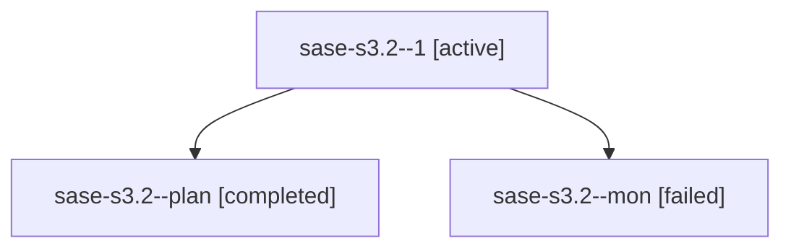

# Family: sase-s3.2

[Agent Hoods](../README.md) / [bbugyi200](../users/bbugyi200/README.md) / [athena](../users/bbugyi200/machines/athena/README.md) / [sase-s3](../users/bbugyi200/machines/athena/hoods/sase-s3/README.md) / sase-s3.2

Owner: `bbugyi200.athena` · Hood: `sase-s3` · Members: 3 · Bead: [sase-s3.2](https://github.com/sase-org/sase--beads/blob/main/pages/sase-s3/sase-s3.2.md)

## Lineage

The diagram is an optional enhancement; the ordered table below contains the same lineage in accessible text.

| Role | Agent | State | Model / provider | Timing | Commits | Prompt | Chat |
|---|---|---|---|---|---:|---|---|
| 1 | sase-s3.2--1 | active | grok-4.6 / grok | 2026-08-22T15:56:29.343585+00:00 | [1](../agents/bbugyi200.athena.sase-s3.2--1/README.md#commits) | [Prompt](../agents/bbugyi200.athena.sase-s3.2--1/prompt.md) | — |
| plan | sase-s3.2--plan | completed | grok-4.6 / grok | 2026-08-22T14:57:33.402309+00:00 → 2026-08-22T15:29:25.386405+00:00 | 0 | [Prompt](../agents/bbugyi200.athena.sase-s3.2--plan/prompt.md) | [Chat](../agents/bbugyi200.athena.sase-s3.2--plan/chat.md) |
| mon | sase-s3.2--mon | failed | grok-4.6 / grok | 2026-08-22T15:29:18.562454+00:00 | 0 | — | [Chat](../agents/bbugyi200.athena.sase-s3.2--mon/chat.md) |

## Commits

| Role | Repo | Commit | Subject | Committed |
|---|---|---|---|---|
| 1 | sase | [`959d559`](https://github.com/sase-org/sase/commit/959d55926de21dc2106a65d943fb3e8e268d1f3b) | feat: raise sase-core-rs floor to 0.30.0 | 2026-08-22 16:03:33 UTC |

## Neighbors

| Agent | Relation | State |
|---|---|---|
| [sase-s3.1](../agents/bbugyi200.athena.sase-s3.1/README.md) | sase-s3 hood | completed |
| [sase-s3.3](../agents/bbugyi200.athena.sase-s3.3/README.md) | sase-s3 hood | completed |
| [sase-s3.4](../agents/bbugyi200.athena.sase-s3.4/README.md) | sase-s3 hood | completed |
| [sase-s3.land](../agents/bbugyi200.athena.sase-s3.land/README.md) | sase-s3 hood | waiting |
