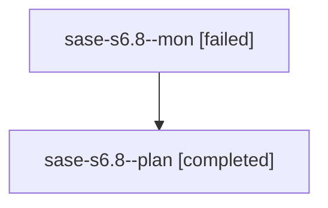

# Family: sase-s6.8

[Agent Hoods](../README.md) / [bbugyi200](../users/bbugyi200/README.md) / [athena](../users/bbugyi200/machines/athena/README.md) / [sase-s6](../users/bbugyi200/machines/athena/hoods/sase-s6/README.md) / sase-s6.8

Owner: `bbugyi200.athena` · Hood: `sase-s6` · Members: 2 · Bead: [sase-s6.8](https://github.com/sase-org/sase--beads/blob/main/pages/sase-s6/sase-s6.8.md)

## Lineage

The diagram is an optional enhancement; the ordered table below contains the same lineage in accessible text.

| Role | Agent | State | Model / provider | Timing | Commits | Prompt | Chat |
|---|---|---|---|---|---:|---|---|
| mon | sase-s6.8--mon | failed | sonnet / claude | 2026-08-23T01:28:07.007273+00:00 | 0 | — | [Chat](../agents/bbugyi200.athena.sase-s6.8--mon/chat.md) |
| plan | sase-s6.8--plan | completed | sonnet / claude | 2026-08-23T01:04:24.287743+00:00 → 2026-08-23T01:28:25.323060+00:00 | 0 | [Prompt](../agents/bbugyi200.athena.sase-s6.8--plan/prompt.md) | [Chat](../agents/bbugyi200.athena.sase-s6.8--plan/chat.md) |

## Neighbors

| Agent | Relation | State |
|---|---|---|
| [sase-s6.1](../agents/bbugyi200.athena.sase-s6.1/README.md) | sase-s6 hood | dismissed |
| [sase-s6.2](../agents/bbugyi200.athena.sase-s6.2/README.md) | sase-s6 hood | completed |
| [sase-s6.3](../agents/bbugyi200.athena.sase-s6.3/README.md) | sase-s6 hood | completed |
| [sase-s6.4](../agents/bbugyi200.athena.sase-s6.4/README.md) | sase-s6 hood | completed |
| [sase-s6.5](../agents/bbugyi200.athena.sase-s6.5/README.md) | sase-s6 hood | completed |
| [sase-s6.6](../agents/bbugyi200.athena.sase-s6.6/README.md) | sase-s6 hood | completed |
| [sase-s6.7](../agents/bbugyi200.athena.sase-s6.7/README.md) | sase-s6 hood | completed |
| [sase-s6.land](../agents/bbugyi200.athena.sase-s6.land/README.md) | sase-s6 hood | waiting |
