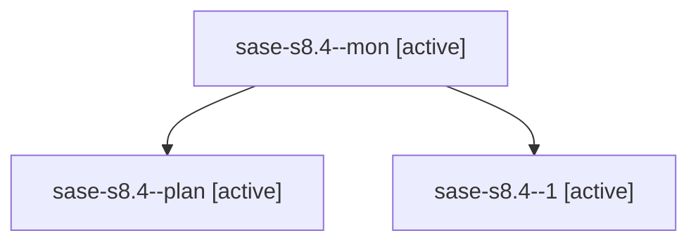

# Family: sase-s8.4

[Agent Hoods](../README.md) / [bbugyi200](../users/bbugyi200/README.md) / [athena](../users/bbugyi200/machines/athena/README.md) / [sase-s8](../users/bbugyi200/machines/athena/hoods/sase-s8/README.md) / sase-s8.4

Owner: `bbugyi200.athena` · Hood: `sase-s8` · Members: 3 · Bead: [sase-s8.4](https://github.com/sase-org/sase--beads/blob/main/pages/sase-s8/sase-s8.4.md)

## Lineage

The diagram is an optional enhancement; the ordered table below contains the same lineage in accessible text.

| Role | Agent | State | Model / provider | Timing | Commits | Prompt | Chat |
|---|---|---|---|---|---:|---|---|
| mon | sase-s8.4--mon | active | gpt-5.5 / codex | 2026-08-23T14:06:48.633758+00:00 | 0 | — | — |
| plan | sase-s8.4--plan | active | gpt-5.5 / codex | 2026-08-23T13:44:15.227540+00:00 | 0 | [Prompt](../agents/bbugyi200.athena.sase-s8.4--plan/prompt.md) | [Chat](../agents/bbugyi200.athena.sase-s8.4--plan/chat.md) |
| 1 | sase-s8.4--1 | active | gpt-5.5 / codex | 2026-08-23T14:36:01.083985+00:00 | [1](../agents/bbugyi200.athena.sase-s8.4--1/README.md#commits) | [Prompt](../agents/bbugyi200.athena.sase-s8.4--1/prompt.md) | — |

## Commits

| Role | Repo | Commit | Subject | Committed |
|---|---|---|---|---|
| 1 | sase | [`ab73c84`](https://github.com/sase-org/sase/commit/ab73c8498d1ccbaef92391d672e134ced27bd321) | docs(agent): document agent wait command | 2026-08-23 10:39:36 EDT |

## Neighbors

| Agent | Relation | State |
|---|---|---|
| [sase-s8.1](../agents/bbugyi200.athena.sase-s8.1/README.md) | sase-s8 hood | active |
| [sase-s8.2](../agents/bbugyi200.athena.sase-s8.2/README.md) | sase-s8 hood | active |
| [sase-s8.3](../agents/bbugyi200.athena.sase-s8.3/README.md) | sase-s8 hood | active |
| [sase-s8.land](../agents/bbugyi200.athena.sase-s8.land/README.md) | sase-s8 hood | active |
