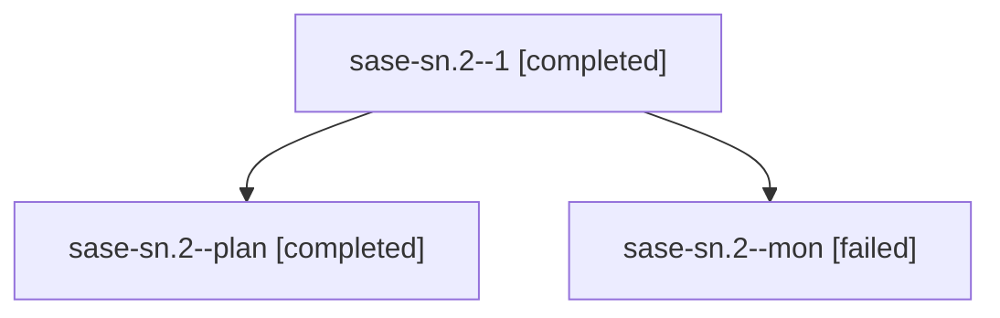

# Family: sase-sn.2

[Agent Hoods](../README.md) / [bbugyi200](../users/bbugyi200/README.md) / [athena](../users/bbugyi200/machines/athena/README.md) / [sase-sn](../users/bbugyi200/machines/athena/hoods/sase-sn/README.md) / sase-sn.2

Owner: `bbugyi200.athena` · Hood: `sase-sn` · Members: 3 · Bead: [sase-sn.2](https://github.com/sase-org/sase--beads/blob/main/pages/sase-sn/sase-sn.2.md)

## Lineage

The diagram is an optional enhancement; the ordered table below contains the same lineage in accessible text.

| Role | Agent | State | Model / provider | Timing | Commits | Prompt | Chat |
|---|---|---|---|---|---:|---|---|
| 1 | sase-sn.2--1 | completed | sonnet / claude | 2026-08-24T10:28:17.156492+00:00 → 2026-08-24T10:37:05.438822+00:00 | [1](../agents/bbugyi200.athena.sase-sn.2--1/README.md#commits) | [Prompt](../agents/bbugyi200.athena.sase-sn.2--1/prompt.md) | [Chat](../agents/bbugyi200.athena.sase-sn.2--1/chat.md) |
| plan | sase-sn.2--plan | completed | sonnet / claude | 2026-08-24T10:13:09.830552+00:00 → 2026-08-24T10:27:48.882969+00:00 | 0 | [Prompt](../agents/bbugyi200.athena.sase-sn.2--plan/prompt.md) | [Chat](../agents/bbugyi200.athena.sase-sn.2--plan/chat.md) |
| mon | sase-sn.2--mon | failed | sonnet / claude | 2026-08-24T10:27:37.477489+00:00 | 0 | — | [Chat](../agents/bbugyi200.athena.sase-sn.2--mon/chat.md) |

## Commits

| Role | Repo | Commit | Subject | Committed |
|---|---|---|---|---|
| 1 | sase | [`4d0da0d`](https://github.com/sase-org/sase/commit/4d0da0d4be1c0ab5284946c3a6393c3d758a6302) | fix(xprompt): bind shorthand text directly from source, not re-lexed | 2026-08-24 06:35:32 EDT |

## Neighbors

| Agent | Relation | State |
|---|---|---|
| [sase-sn.1](../agents/bbugyi200.athena.sase-sn.1/README.md) | sase-sn hood | active |
| [sase-sn.3](../agents/bbugyi200.athena.sase-sn.3/README.md) | sase-sn hood | active |
| [sase-sn.4](../agents/bbugyi200.athena.sase-sn.4/README.md) | sase-sn hood | waiting |
| [sase-sn.5](../agents/bbugyi200.athena.sase-sn.5/README.md) | sase-sn hood | waiting |
| [sase-sn.6](../agents/bbugyi200.athena.sase-sn.6/README.md) | sase-sn hood | waiting |
| [sase-sn.land](../agents/bbugyi200.athena.sase-sn.land/README.md) | sase-sn hood | waiting |
