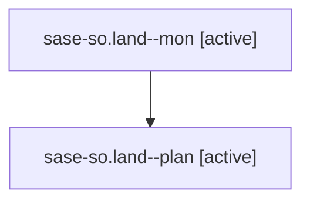

# Family: sase-so.land

[Agent Hoods](../README.md) / [bbugyi200](../users/bbugyi200/README.md) / [athena](../users/bbugyi200/machines/athena/README.md) / [sase-so](../users/bbugyi200/machines/athena/hoods/sase-so/README.md) / sase-so.land

Owner: `bbugyi200.athena` · Hood: `sase-so` · Members: 2 · Bead: [sase-so](https://github.com/sase-org/sase--beads/blob/main/pages/sase-so/README.md)

## Lineage

The diagram is an optional enhancement; the ordered table below contains the same lineage in accessible text.

| Role | Agent | State | Model / provider | Timing | Commits | Prompt | Chat |
|---|---|---|---|---|---:|---|---|
| mon | sase-so.land--mon | active | gpt-5.6-sol / codex | 2026-08-24T13:54:03.899423+00:00 | 0 | — | — |
| plan | sase-so.land--plan | active | gpt-5.6-sol / codex | 2026-08-24T13:23:42.868953+00:00 | 0 | [Prompt](../agents/bbugyi200.athena.sase-so.land--plan/prompt.md) | [Chat](../agents/bbugyi200.athena.sase-so.land--plan/chat.md) |

## Neighbors

| Agent | Relation | State |
|---|---|---|
| [sase-so.1](../agents/bbugyi200.athena.sase-so.1/README.md) | sase-so hood | active |
| [sase-so.2](../agents/bbugyi200.athena.sase-so.2/README.md) | sase-so hood | active |
| [sase-so.3](../agents/bbugyi200.athena.sase-so.3/README.md) | sase-so hood | active |
| [sase-so.4](../agents/bbugyi200.athena.sase-so.4/README.md) | sase-so hood | active |
