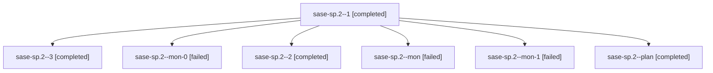

# Family: sase-sp.2

[Agent Hoods](../README.md) / [bbugyi200](../users/bbugyi200/README.md) / [athena](../users/bbugyi200/machines/athena/README.md) / [sase-sp](../users/bbugyi200/machines/athena/hoods/sase-sp/README.md) / sase-sp.2

Owner: `bbugyi200.athena` · Hood: `sase-sp` · Members: 7 · Bead: [sase-sp.2](https://github.com/sase-org/sase--beads/blob/main/pages/sase-sp/sase-sp.2.md)

## Lineage

The diagram is an optional enhancement; the ordered table below contains the same lineage in accessible text.

| Role | Agent | State | Model / provider | Timing | Commits | Prompt | Chat |
|---|---|---|---|---|---:|---|---|
| 1 | sase-sp.2--1 | completed | sonnet / claude | 2026-08-24T14:35:30.658621+00:00 → 2026-08-24T14:49:06.008972+00:00 | 0 | [Prompt](../agents/bbugyi200.athena.sase-sp.2--1/prompt.md) | [Chat](../agents/bbugyi200.athena.sase-sp.2--1/chat.md) |
| 3 | sase-sp.2--3 | completed | sonnet / claude | 2026-08-24T14:55:24.777717+00:00 → 2026-08-24T15:02:24.406258+00:00 | 0 | [Prompt](../agents/bbugyi200.athena.sase-sp.2--3/prompt.md) | [Chat](../agents/bbugyi200.athena.sase-sp.2--3/chat.md) |
| mon-0 | sase-sp.2--mon-0 | failed | sonnet / claude | 2026-08-24T14:47:46.882183+00:00 | 0 | — | [Chat](../agents/bbugyi200.athena.sase-sp.2--mon-0/chat.md) |
| 2 | sase-sp.2--2 | completed | sonnet / claude | 2026-08-24T14:51:37.743705+00:00 → 2026-08-24T14:52:39.590050+00:00 | 0 | [Prompt](../agents/bbugyi200.athena.sase-sp.2--2/prompt.md) | [Chat](../agents/bbugyi200.athena.sase-sp.2--2/chat.md) |
| mon | sase-sp.2--mon | failed | sonnet / claude | 2026-08-24T13:42:04.669313+00:00 | 0 | — | [Chat](../agents/bbugyi200.athena.sase-sp.2--mon/chat.md) |
| mon-1 | sase-sp.2--mon-1 | failed | sonnet / claude | 2026-08-24T14:52:31.535220+00:00 | 0 | — | [Chat](../agents/bbugyi200.athena.sase-sp.2--mon-1/chat.md) |
| plan | sase-sp.2--plan | completed | sonnet / claude | 2026-08-24T13:37:23.346197+00:00 → 2026-08-24T13:42:22.774040+00:00 | 0 | [Prompt](../agents/bbugyi200.athena.sase-sp.2--plan/prompt.md) | [Chat](../agents/bbugyi200.athena.sase-sp.2--plan/chat.md) |

## Commits

| Role | Repo | Commit | Subject | Committed |
|---|---|---|---|---|
| — | sase | [`570b6be`](https://github.com/sase-org/sase/commit/570b6be4b0c12eec328e1b8c66ac1440672fd81a) | feat(finalizers): raise sase-core-rs floor and wire FinalizerDeferralWire | 2026-08-24 11:01:09 EDT |

## Neighbors

| Agent | Relation | State |
|---|---|---|
| [sase-sp.1](../agents/bbugyi200.athena.sase-sp.1/README.md) | sase-sp hood | completed |
| [sase-sp.3](../agents/bbugyi200.athena.sase-sp.3/README.md) | sase-sp hood | completed |
| [sase-sp.4](bbugyi200.athena.sase-sp.4.md) (family · 7) | sase-sp hood | completed 4, failed 3 |
| [sase-sp.5](../agents/bbugyi200.athena.sase-sp.5/README.md) | sase-sp hood | completed |
| [sase-sp.6](../agents/bbugyi200.athena.sase-sp.6/README.md) | sase-sp hood | completed |
| [sase-sp.land](../agents/bbugyi200.athena.sase-sp.land/README.md) | sase-sp hood | completed |
