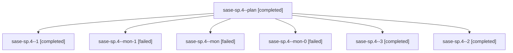

# Family: sase-sp.4

[Agent Hoods](../README.md) / [bbugyi200](../users/bbugyi200/README.md) / [athena](../users/bbugyi200/machines/athena/README.md) / [sase-sp](../users/bbugyi200/machines/athena/hoods/sase-sp/README.md) / sase-sp.4

Owner: `bbugyi200.athena` · Hood: `sase-sp` · Members: 7 · Bead: [sase-sp.4](https://github.com/sase-org/sase--beads/blob/main/pages/sase-sp/sase-sp.4.md)

## Lineage

The diagram is an optional enhancement; the ordered table below contains the same lineage in accessible text.

| Role | Agent | State | Model / provider | Timing | Commits | Prompt | Chat |
|---|---|---|---|---|---:|---|---|
| plan | sase-sp.4--plan | completed | sonnet / claude | 2026-08-24T16:15:02.673327+00:00 → 2026-08-24T16:57:26.912467+00:00 | 0 | [Prompt](../agents/bbugyi200.athena.sase-sp.4--plan/prompt.md) | [Chat](../agents/bbugyi200.athena.sase-sp.4--plan/chat.md) |
| 1 | sase-sp.4--1 | completed | sonnet / claude | 2026-08-24T17:04:58.819015+00:00 → 2026-08-24T17:06:35.825626+00:00 | 0 | [Prompt](../agents/bbugyi200.athena.sase-sp.4--1/prompt.md) | [Chat](../agents/bbugyi200.athena.sase-sp.4--1/chat.md) |
| mon-1 | sase-sp.4--mon-1 | failed | sonnet / claude | 2026-08-24T17:14:29.557045+00:00 | 0 | — | [Chat](../agents/bbugyi200.athena.sase-sp.4--mon-1/chat.md) |
| mon | sase-sp.4--mon | failed | sonnet / claude | 2026-08-24T16:57:13.153167+00:00 | 0 | — | [Chat](../agents/bbugyi200.athena.sase-sp.4--mon/chat.md) |
| mon-0 | sase-sp.4--mon-0 | failed | sonnet / claude | 2026-08-24T17:05:58.478733+00:00 | 0 | — | [Chat](../agents/bbugyi200.athena.sase-sp.4--mon-0/chat.md) |
| 3 | sase-sp.4--3 | completed | sonnet / claude | 2026-08-24T17:18:06.193170+00:00 → 2026-08-24T17:23:12.431977+00:00 | [1](../agents/bbugyi200.athena.sase-sp.4--3/README.md#commits) | [Prompt](../agents/bbugyi200.athena.sase-sp.4--3/prompt.md) | [Chat](../agents/bbugyi200.athena.sase-sp.4--3/chat.md) |
| 2 | sase-sp.4--2 | completed | sonnet / claude | 2026-08-24T17:10:20.163779+00:00 → 2026-08-24T17:14:55.470695+00:00 | 0 | [Prompt](../agents/bbugyi200.athena.sase-sp.4--2/prompt.md) | [Chat](../agents/bbugyi200.athena.sase-sp.4--2/chat.md) |

## Commits

| Role | Repo | Commit | Subject | Committed |
|---|---|---|---|---|
| 3 | sase | [`2b046b1`](https://github.com/sase-org/sase/commit/2b046b17460b2e86e24a157c1ba54a97549fd06a) | feat(finalizers): defer commit on refusal instead of failing the turn | 2026-08-24 13:22:05 EDT |

## Neighbors

| Agent | Relation | State |
|---|---|---|
| [sase-sp.1](../agents/bbugyi200.athena.sase-sp.1/README.md) | sase-sp hood | completed |
| [sase-sp.2](bbugyi200.athena.sase-sp.2.md) (family · 7) | sase-sp hood | completed 4, failed 3 |
| [sase-sp.3](../agents/bbugyi200.athena.sase-sp.3/README.md) | sase-sp hood | completed |
| [sase-sp.5](../agents/bbugyi200.athena.sase-sp.5/README.md) | sase-sp hood | completed |
| [sase-sp.6](../agents/bbugyi200.athena.sase-sp.6/README.md) | sase-sp hood | completed |
| [sase-sp.land](../agents/bbugyi200.athena.sase-sp.land/README.md) | sase-sp hood | completed |
