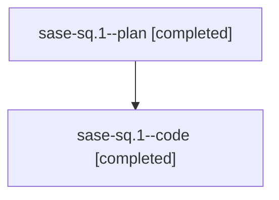

# Family: sase-sq.1

[Agent Hoods](../README.md) / [bbugyi200](../users/bbugyi200/README.md) / [athena](../users/bbugyi200/machines/athena/README.md) / [sase-sq](../users/bbugyi200/machines/athena/hoods/sase-sq/README.md) / sase-sq.1

Owner: `bbugyi200.athena` · Hood: `sase-sq` · Members: 2 · Bead: [sase-sq.1](https://github.com/sase-org/sase--beads/blob/main/pages/sase-sq/sase-sq.1.md)

## Lineage

The diagram is an optional enhancement; the ordered table below contains the same lineage in accessible text.

| Role | Agent | State | Model / provider | Timing | Commits | Prompt | Chat |
|---|---|---|---|---|---:|---|---|
| plan | sase-sq.1--plan | completed | opus / claude | 2026-08-24T14:34:55.986220+00:00 → 2026-08-24T16:51:10.892760+00:00 | 0 | [Prompt](../agents/bbugyi200.athena.sase-sq.1--plan/prompt.md) | [Chat](../agents/bbugyi200.athena.sase-sq.1--plan/chat.md) |
| code | sase-sq.1--code | completed | gpt-5.5 / codex | 2026-08-24T14:49:12.154544+00:00 → 2026-08-24T16:51:10.892760+00:00 | 0 | — | [Chat](../agents/bbugyi200.athena.sase-sq.1--code/chat.md) |

## Commits

| Role | Repo | Commit | Subject | Committed |
|---|---|---|---|---|
| — | sase | [`c9ca0db`](https://github.com/sase-org/sase/commit/c9ca0db5f8d0d7b5d007010e661abb1d2b5638dc) | feat(memory): rename memory tiers to core and reference | 2026-08-24 12:41:31 EDT |

## Neighbors

| Agent | Relation | State |
|---|---|---|
| [sase-sq.2](bbugyi200.athena.sase-sq.2.md) (family · 2) | sase-sq hood | active 1, dismissed 1 |
| [sase-sq.3](../agents/bbugyi200.athena.sase-sq.3/README.md) | sase-sq hood | completed |
| [sase-sq.4](../agents/bbugyi200.athena.sase-sq.4/README.md) | sase-sq hood | completed |
| [sase-sq.5](bbugyi200.athena.sase-sq.5.md) (family · 7) | sase-sq hood | completed 4, failed 3 |
| [sase-sq.6](../agents/bbugyi200.athena.sase-sq.6/README.md) | sase-sq hood | active |
| [sase-sq.7](bbugyi200.athena.sase-sq.7.md) (family · 2) | sase-sq hood | failed 2 |
| [sase-sq.7.1.1](../agents/bbugyi200.athena.sase-sq.7.1.1/README.md) | sase-sq hood | active |
| [sase-sq.7.1.2](../agents/bbugyi200.athena.sase-sq.7.1.2/README.md) | sase-sq hood | failed |
| [sase-sq.7.1.2.f0](../agents/bbugyi200.athena.sase-sq.7.1.2.f0/README.md) | sase-sq hood | failed |
| [sase-sq.7.1.3](../agents/bbugyi200.athena.sase-sq.7.1.3/README.md) | sase-sq hood | waiting |
| [sase-sq.7.1.4](../agents/bbugyi200.athena.sase-sq.7.1.4/README.md) | sase-sq hood | waiting |
| [sase-sq.7.1.5](../agents/bbugyi200.athena.sase-sq.7.1.5/README.md) | sase-sq hood | waiting |
| [sase-sq.7.1.6](../agents/bbugyi200.athena.sase-sq.7.1.6/README.md) | sase-sq hood | waiting |
| [sase-sq.7.1.land](../agents/bbugyi200.athena.sase-sq.7.1.land/README.md) | sase-sq hood | waiting |
| [sase-sq.8](../agents/bbugyi200.athena.sase-sq.8/README.md) | sase-sq hood | waiting |
| [sase-sq.land](../agents/bbugyi200.athena.sase-sq.land/README.md) | sase-sq hood | waiting |
