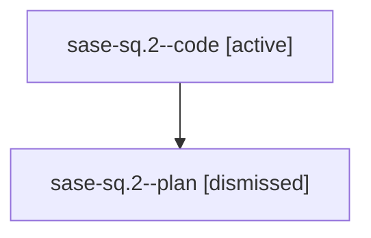

# Family: sase-sq.2

[Agent Hoods](../README.md) / [bbugyi200](../users/bbugyi200/README.md) / [athena](../users/bbugyi200/machines/athena/README.md) / [sase-sq](../users/bbugyi200/machines/athena/hoods/sase-sq/README.md) / sase-sq.2

Owner: `bbugyi200.athena` · Hood: `sase-sq` · Members: 2 · Bead: [sase-sq.2](https://github.com/sase-org/sase--beads/blob/main/pages/sase-sq/sase-sq.2.md)

## Lineage

The diagram is an optional enhancement; the ordered table below contains the same lineage in accessible text.

| Role | Agent | State | Model / provider | Timing | Commits | Prompt | Chat |
|---|---|---|---|---|---:|---|---|
| code | sase-sq.2--code | active | gpt-5.5 / codex | 2026-08-24T16:55:57.889864+00:00 | 0 | — | — |
| plan | sase-sq.2--plan | dismissed | — | 2026-08-24T10:34:22 | 0 | — | — |

## Commits

| Role | Repo | Commit | Subject | Committed |
|---|---|---|---|---|
| — | sase | [`f72ff9f`](https://github.com/sase-org/sase/commit/f72ff9f385643bfe1f7a9b35f72702bd4b055163) | feat(memory): add memory web substrate | 2026-08-24 13:51:40 EDT |

## Neighbors

| Agent | Relation | State |
|---|---|---|
| [sase-sq.1](bbugyi200.athena.sase-sq.1.md) (family · 2) | sase-sq hood | completed 2 |
| [sase-sq.3](../agents/bbugyi200.athena.sase-sq.3/README.md) | sase-sq hood | completed |
| [sase-sq.4](../agents/bbugyi200.athena.sase-sq.4/README.md) | sase-sq hood | completed |
| [sase-sq.5](bbugyi200.athena.sase-sq.5.md) (family · 7) | sase-sq hood | completed 4, failed 3 |
| [sase-sq.6](../agents/bbugyi200.athena.sase-sq.6/README.md) | sase-sq hood | completed |
| [sase-sq.7](bbugyi200.athena.sase-sq.7.md) (family · 2) | sase-sq hood | failed 2 |
| [sase-sq.7.1.1](../agents/bbugyi200.athena.sase-sq.7.1.1/README.md) | sase-sq hood | completed |
| [sase-sq.7.1.2](../agents/bbugyi200.athena.sase-sq.7.1.2/README.md) | sase-sq hood | completed |
| [sase-sq.7.1.2.f0](../agents/bbugyi200.athena.sase-sq.7.1.2.f0/README.md) | sase-sq hood | dismissed |
| [sase-sq.7.1.2.f0.f0](../agents/bbugyi200.athena.sase-sq.7.1.2.f0.f0/README.md) | sase-sq hood | dismissed |
| [sase-sq.7.1.3](bbugyi200.athena.sase-sq.7.1.3.md) (family · 5) | sase-sq hood | completed 3, failed 2 |
| [sase-sq.7.1.4](../agents/bbugyi200.athena.sase-sq.7.1.4/README.md) | sase-sq hood | active |
| [sase-sq.7.1.5](../agents/bbugyi200.athena.sase-sq.7.1.5/README.md) | sase-sq hood | completed |
| [sase-sq.7.1.6](../agents/bbugyi200.athena.sase-sq.7.1.6/README.md) | sase-sq hood | waiting |
| [sase-sq.7.1.land](../agents/bbugyi200.athena.sase-sq.7.1.land/README.md) | sase-sq hood | waiting |
| [sase-sq.8](../agents/bbugyi200.athena.sase-sq.8/README.md) | sase-sq hood | waiting |
| [sase-sq.land](../agents/bbugyi200.athena.sase-sq.land/README.md) | sase-sq hood | waiting |
