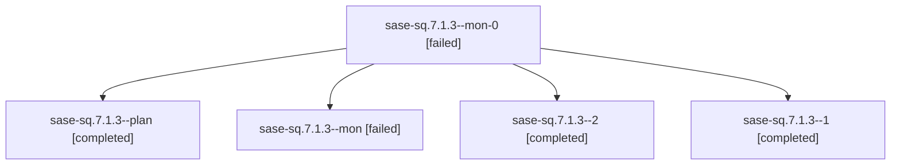

# Family: sase-sq.7.1.3

[Agent Hoods](../README.md) / [bbugyi200](../users/bbugyi200/README.md) / [athena](../users/bbugyi200/machines/athena/README.md) / [sase-sq](../users/bbugyi200/machines/athena/hoods/sase-sq/README.md) / sase-sq.7.1.3

Owner: `bbugyi200.athena` · Hood: `sase-sq` · Members: 5 · Bead: [sase-sq.7.1.3](https://github.com/sase-org/sase--beads/blob/main/pages/sase-sq/sase-sq.7.1.3.md)

## Lineage

The diagram is an optional enhancement; the ordered table below contains the same lineage in accessible text.

| Role | Agent | State | Model / provider | Timing | Commits | Prompt | Chat |
|---|---|---|---|---|---:|---|---|
| mon-0 | sase-sq.7.1.3--mon-0 | failed | sonnet / claude | 2026-08-25T00:06:03.682533+00:00 | 0 | — | [Chat](../agents/bbugyi200.athena.sase-sq.7.1.3--mon-0/chat.md) |
| plan | sase-sq.7.1.3--plan | completed | sonnet / claude | 2026-08-24T23:23:19.476905+00:00 → 2026-08-24T23:54:36.834611+00:00 | 0 | [Prompt](../agents/bbugyi200.athena.sase-sq.7.1.3--plan/prompt.md) | [Chat](../agents/bbugyi200.athena.sase-sq.7.1.3--plan/chat.md) |
| mon | sase-sq.7.1.3--mon | failed | sonnet / claude | 2026-08-24T23:54:25.998422+00:00 | 0 | — | [Chat](../agents/bbugyi200.athena.sase-sq.7.1.3--mon/chat.md) |
| 2 | sase-sq.7.1.3--2 | completed | sonnet / claude | 2026-08-25T00:18:35.249801+00:00 → 2026-08-25T00:23:44.475083+00:00 | [1](../agents/bbugyi200.athena.sase-sq.7.1.3--2/README.md#commits) | [Prompt](../agents/bbugyi200.athena.sase-sq.7.1.3--2/prompt.md) | [Chat](../agents/bbugyi200.athena.sase-sq.7.1.3--2/chat.md) |
| 1 | sase-sq.7.1.3--1 | completed | sonnet / claude | 2026-08-25T00:02:40.381748+00:00 → 2026-08-25T00:06:27.320507+00:00 | 0 | [Prompt](../agents/bbugyi200.athena.sase-sq.7.1.3--1/prompt.md) | [Chat](../agents/bbugyi200.athena.sase-sq.7.1.3--1/chat.md) |

## Commits

| Role | Repo | Commit | Subject | Committed |
|---|---|---|---|---|
| 2 | sase | [`2b16a06`](https://github.com/sase-org/sase/commit/2b16a06483d60ab04cb5dc8cc7ce4966d76c2bac) | feat(memory): back the glossary catalog with strand-backed sources and fail-closed dual truth | 2026-08-24 20:21:42 EDT |

## Neighbors

| Agent | Relation | State |
|---|---|---|
| [sase-sq.7](bbugyi200.athena.sase-sq.7.md) (family · 2) | ancestor | failed 2 |
| [sase-sq.7.1.1](../agents/bbugyi200.athena.sase-sq.7.1.1/README.md) | sase-sq.7.1 hood | completed |
| [sase-sq.7.1.2](../agents/bbugyi200.athena.sase-sq.7.1.2/README.md) | sase-sq.7.1 hood | completed |
| [sase-sq.7.1.2.f0](../agents/bbugyi200.athena.sase-sq.7.1.2.f0/README.md) | sase-sq.7.1 hood | dismissed |
| [sase-sq.7.1.2.f0.f0](../agents/bbugyi200.athena.sase-sq.7.1.2.f0.f0/README.md) | sase-sq.7.1 hood | dismissed |
| [sase-sq.7.1.4](../agents/bbugyi200.athena.sase-sq.7.1.4/README.md) | sase-sq.7.1 hood | completed |
| [sase-sq.7.1.5](../agents/bbugyi200.athena.sase-sq.7.1.5/README.md) | sase-sq.7.1 hood | completed |
| [sase-sq.7.1.6](bbugyi200.athena.sase-sq.7.1.6.md) (family · 7) | sase-sq.7.1 hood | completed 4, failed 3 |
| [sase-sq.7.1.land](../agents/bbugyi200.athena.sase-sq.7.1.land/README.md) | sase-sq.7.1 hood | completed |
| [sase-sq.1](bbugyi200.athena.sase-sq.1.md) (family · 2) | sase-sq hood | completed 2 |
| [sase-sq.2](bbugyi200.athena.sase-sq.2.md) (family · 2) | sase-sq hood | active 1, dismissed 1 |
| [sase-sq.3](../agents/bbugyi200.athena.sase-sq.3/README.md) | sase-sq hood | completed |
| [sase-sq.4](../agents/bbugyi200.athena.sase-sq.4/README.md) | sase-sq hood | completed |
| [sase-sq.5](bbugyi200.athena.sase-sq.5.md) (family · 7) | sase-sq hood | completed 4, failed 3 |
| [sase-sq.6](../agents/bbugyi200.athena.sase-sq.6/README.md) | sase-sq hood | completed |
| [sase-sq.8](bbugyi200.athena.sase-sq.8.md) (family · 2) | sase-sq hood | failed 2 |
| [sase-sq.8.1.1](../agents/bbugyi200.athena.sase-sq.8.1.1/README.md) | sase-sq hood | completed |
| [sase-sq.8.1.2](../agents/bbugyi200.athena.sase-sq.8.1.2/README.md) | sase-sq hood | active |
| [sase-sq.8.1.3](../agents/bbugyi200.athena.sase-sq.8.1.3/README.md) | sase-sq hood | waiting |
| [sase-sq.8.1.land](../agents/bbugyi200.athena.sase-sq.8.1.land/README.md) | sase-sq hood | waiting |
| [sase-sq.land](../agents/bbugyi200.athena.sase-sq.land/README.md) | sase-sq hood | waiting |
