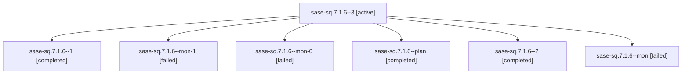

# Family: sase-sq.7.1.6

[Agent Hoods](../README.md) / [bbugyi200](../users/bbugyi200/README.md) / [athena](../users/bbugyi200/machines/athena/README.md) / [sase-sq](../users/bbugyi200/machines/athena/hoods/sase-sq/README.md) / sase-sq.7.1.6

Owner: `bbugyi200.athena` · Hood: `sase-sq` · Members: 7 · Bead: [sase-sq.7.1.6](https://github.com/sase-org/sase--beads/blob/main/pages/sase-sq/sase-sq.7.1.6.md)

## Lineage

The diagram is an optional enhancement; the ordered table below contains the same lineage in accessible text.

| Role | Agent | State | Model / provider | Timing | Commits | Prompt | Chat |
|---|---|---|---|---|---:|---|---|
| 3 | sase-sq.7.1.6--3 | active | gpt-5.5 / codex | 2026-08-25T02:13:38.786716+00:00 | [1](../agents/bbugyi200.athena.sase-sq.7.1.6--3/README.md#commits) | [Prompt](../agents/bbugyi200.athena.sase-sq.7.1.6--3/prompt.md) | — |
| 1 | sase-sq.7.1.6--1 | completed | gpt-5.5 / codex | 2026-08-25T01:42:17.270515+00:00 → 2026-08-25T01:46:04.802341+00:00 | 0 | [Prompt](../agents/bbugyi200.athena.sase-sq.7.1.6--1/prompt.md) | [Chat](../agents/bbugyi200.athena.sase-sq.7.1.6--1/chat.md) |
| mon-1 | sase-sq.7.1.6--mon-1 | failed | gpt-5.5 / codex | 2026-08-25T01:55:17.195331+00:00 | 0 | — | [Chat](../agents/bbugyi200.athena.sase-sq.7.1.6--mon-1/chat.md) |
| mon-0 | sase-sq.7.1.6--mon-0 | failed | gpt-5.5 / codex | 2026-08-25T01:45:57.278597+00:00 | 0 | — | [Chat](../agents/bbugyi200.athena.sase-sq.7.1.6--mon-0/chat.md) |
| plan | sase-sq.7.1.6--plan | completed | gpt-5.5 / codex | 2026-08-25T01:25:06.877009+00:00 → 2026-08-25T01:41:30.178224+00:00 | 0 | [Prompt](../agents/bbugyi200.athena.sase-sq.7.1.6--plan/prompt.md) | [Chat](../agents/bbugyi200.athena.sase-sq.7.1.6--plan/chat.md) |
| 2 | sase-sq.7.1.6--2 | completed | gpt-5.5 / codex | 2026-08-25T01:49:03.739607+00:00 → 2026-08-25T01:55:23.999626+00:00 | 0 | [Prompt](../agents/bbugyi200.athena.sase-sq.7.1.6--2/prompt.md) | [Chat](../agents/bbugyi200.athena.sase-sq.7.1.6--2/chat.md) |
| mon | sase-sq.7.1.6--mon | failed | gpt-5.5 / codex | 2026-08-25T01:41:22.895045+00:00 | 0 | — | [Chat](../agents/bbugyi200.athena.sase-sq.7.1.6--mon/chat.md) |

## Commits

| Role | Repo | Commit | Subject | Committed |
|---|---|---|---|---|
| 3 | sase | [`df95621`](https://github.com/sase-org/sase/commit/df956212be2c5c246cb45207c753623b3ca92f5e) | feat(memory): migrate sase glossary to web | 2026-08-24 22:24:33 EDT |

## Neighbors

| Agent | Relation | State |
|---|---|---|
| [sase-sq.7](bbugyi200.athena.sase-sq.7.md) (family · 2) | ancestor | failed 2 |
| [sase-sq.7.1.1](../agents/bbugyi200.athena.sase-sq.7.1.1/README.md) | sase-sq.7.1 hood | completed |
| [sase-sq.7.1.2](../agents/bbugyi200.athena.sase-sq.7.1.2/README.md) | sase-sq.7.1 hood | completed |
| [sase-sq.7.1.2.f0](../agents/bbugyi200.athena.sase-sq.7.1.2.f0/README.md) | sase-sq.7.1 hood | dismissed |
| [sase-sq.7.1.2.f0.f0](../agents/bbugyi200.athena.sase-sq.7.1.2.f0.f0/README.md) | sase-sq.7.1 hood | dismissed |
| [sase-sq.7.1.3](bbugyi200.athena.sase-sq.7.1.3.md) (family · 5) | sase-sq.7.1 hood | completed 3, failed 2 |
| [sase-sq.7.1.4](../agents/bbugyi200.athena.sase-sq.7.1.4/README.md) | sase-sq.7.1 hood | completed |
| [sase-sq.7.1.5](../agents/bbugyi200.athena.sase-sq.7.1.5/README.md) | sase-sq.7.1 hood | completed |
| [sase-sq.7.1.land](../agents/bbugyi200.athena.sase-sq.7.1.land/README.md) | sase-sq.7.1 hood | waiting |
| [sase-sq.1](bbugyi200.athena.sase-sq.1.md) (family · 2) | sase-sq hood | completed 2 |
| [sase-sq.2](bbugyi200.athena.sase-sq.2.md) (family · 2) | sase-sq hood | active 1, dismissed 1 |
| [sase-sq.3](../agents/bbugyi200.athena.sase-sq.3/README.md) | sase-sq hood | completed |
| [sase-sq.4](../agents/bbugyi200.athena.sase-sq.4/README.md) | sase-sq hood | completed |
| [sase-sq.5](bbugyi200.athena.sase-sq.5.md) (family · 7) | sase-sq hood | completed 4, failed 3 |
| [sase-sq.6](../agents/bbugyi200.athena.sase-sq.6/README.md) | sase-sq hood | completed |
| [sase-sq.8](../agents/bbugyi200.athena.sase-sq.8/README.md) | sase-sq hood | waiting |
| [sase-sq.land](../agents/bbugyi200.athena.sase-sq.land/README.md) | sase-sq hood | waiting |
