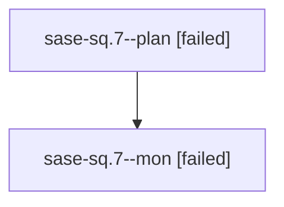

# Family: sase-sq.7

[Agent Hoods](../README.md) / [bbugyi200](../users/bbugyi200/README.md) / [athena](../users/bbugyi200/machines/athena/README.md) / [sase-sq](../users/bbugyi200/machines/athena/hoods/sase-sq/README.md) / sase-sq.7

Owner: `bbugyi200.athena` · Hood: `sase-sq` · Members: 2 · Bead: [sase-sq.7](https://github.com/sase-org/sase--beads/blob/main/pages/sase-sq/sase-sq.7.md)

## Lineage

The diagram is an optional enhancement; the ordered table below contains the same lineage in accessible text.

| Role | Agent | State | Model / provider | Timing | Commits | Prompt | Chat |
|---|---|---|---|---|---:|---|---|
| plan | sase-sq.7--plan | failed | opus / claude | 2026-08-24T22:01:06.396170+00:00 → 2026-08-24T22:14:06.929199+00:00 | 0 | [Prompt](../agents/bbugyi200.athena.sase-sq.7--plan/prompt.md) | [Chat](../agents/bbugyi200.athena.sase-sq.7--plan/chat.md) |
| mon | sase-sq.7--mon | failed | opus / claude | 2026-08-24T22:13:54.039714+00:00 | 0 | — | [Chat](../agents/bbugyi200.athena.sase-sq.7--mon/chat.md) |

## Neighbors

| Agent | Relation | State |
|---|---|---|
| [sase-sq.7.1.1](../agents/bbugyi200.athena.sase-sq.7.1.1/README.md) | descendant | completed |
| [sase-sq.7.1.2](../agents/bbugyi200.athena.sase-sq.7.1.2/README.md) | descendant | completed |
| [sase-sq.7.1.2.f0](../agents/bbugyi200.athena.sase-sq.7.1.2.f0/README.md) | descendant | dismissed |
| [sase-sq.7.1.2.f0.f0](../agents/bbugyi200.athena.sase-sq.7.1.2.f0.f0/README.md) | descendant | dismissed |
| [sase-sq.7.1.3](bbugyi200.athena.sase-sq.7.1.3.md) (family · 5) | descendant | completed 3, failed 2 |
| [sase-sq.7.1.4](../agents/bbugyi200.athena.sase-sq.7.1.4/README.md) | descendant | completed |
| [sase-sq.7.1.5](../agents/bbugyi200.athena.sase-sq.7.1.5/README.md) | descendant | completed |
| [sase-sq.7.1.6](bbugyi200.athena.sase-sq.7.1.6.md) (family · 7) | descendant | completed 4, failed 3 |
| [sase-sq.7.1.land](../agents/bbugyi200.athena.sase-sq.7.1.land/README.md) | descendant | completed |
| [sase-sq.1](bbugyi200.athena.sase-sq.1.md) (family · 2) | sase-sq hood | completed 2 |
| [sase-sq.2](bbugyi200.athena.sase-sq.2.md) (family · 2) | sase-sq hood | active 1, dismissed 1 |
| [sase-sq.3](../agents/bbugyi200.athena.sase-sq.3/README.md) | sase-sq hood | completed |
| [sase-sq.4](../agents/bbugyi200.athena.sase-sq.4/README.md) | sase-sq hood | completed |
| [sase-sq.5](bbugyi200.athena.sase-sq.5.md) (family · 7) | sase-sq hood | completed 4, failed 3 |
| [sase-sq.6](../agents/bbugyi200.athena.sase-sq.6/README.md) | sase-sq hood | completed |
| [sase-sq.8](bbugyi200.athena.sase-sq.8.md) (family · 2) | sase-sq hood | failed 2 |
| [sase-sq.8.1.1](../agents/bbugyi200.athena.sase-sq.8.1.1/README.md) | sase-sq hood | completed |
| [sase-sq.8.1.2](../agents/bbugyi200.athena.sase-sq.8.1.2/README.md) | sase-sq hood | completed |
| [sase-sq.8.1.3](../agents/bbugyi200.athena.sase-sq.8.1.3/README.md) | sase-sq hood | active |
| [sase-sq.8.1.land](../agents/bbugyi200.athena.sase-sq.8.1.land/README.md) | sase-sq hood | waiting |
| [sase-sq.land](../agents/bbugyi200.athena.sase-sq.land/README.md) | sase-sq hood | waiting |
