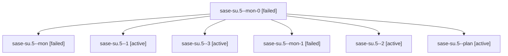

# Family: sase-su.5

[Agent Hoods](../README.md) / [bbugyi200](../users/bbugyi200/README.md) / [athena](../users/bbugyi200/machines/athena/README.md) / [sase-su](../users/bbugyi200/machines/athena/hoods/sase-su/README.md) / sase-su.5

Owner: `bbugyi200.athena` · Hood: `sase-su` · Members: 7 · Bead: [sase-su.5](https://github.com/sase-org/sase--beads/blob/main/pages/sase-su/sase-su.5.md)

## Lineage

The diagram is an optional enhancement; the ordered table below contains the same lineage in accessible text.

| Role | Agent | State | Model / provider | Timing | Commits | Prompt | Chat |
|---|---|---|---|---|---:|---|---|
| mon-0 | sase-su.5--mon-0 | failed | sonnet / claude | 2026-08-24T18:46:27.078179+00:00 | 0 | — | [Chat](../agents/bbugyi200.athena.sase-su.5--mon-0/chat.md) |
| mon | sase-su.5--mon | failed | sonnet / claude | 2026-08-24T18:41:51.643571+00:00 | 0 | — | [Chat](../agents/bbugyi200.athena.sase-su.5--mon/chat.md) |
| 1 | sase-su.5--1 | active | sonnet / claude | 2026-08-24T18:45:01.670681+00:00 | 0 | [Prompt](../agents/bbugyi200.athena.sase-su.5--1/prompt.md) | [Chat](../agents/bbugyi200.athena.sase-su.5--1/chat.md) |
| 3 | sase-su.5--3 | active | sonnet / claude | 2026-08-24T19:25:09.454964+00:00 | [1](../agents/bbugyi200.athena.sase-su.5--3/README.md#commits) | [Prompt](../agents/bbugyi200.athena.sase-su.5--3/prompt.md) | — |
| mon-1 | sase-su.5--mon-1 | failed | sonnet / claude | 2026-08-24T19:09:40.979053+00:00 | 0 | — | [Chat](../agents/bbugyi200.athena.sase-su.5--mon-1/chat.md) |
| 2 | sase-su.5--2 | active | sonnet / claude | 2026-08-24T19:07:28.578934+00:00 | 0 | [Prompt](../agents/bbugyi200.athena.sase-su.5--2/prompt.md) | [Chat](../agents/bbugyi200.athena.sase-su.5--2/chat.md) |
| plan | sase-su.5--plan | active | sonnet / claude | 2026-08-24T17:31:57.238135+00:00 | 0 | [Prompt](../agents/bbugyi200.athena.sase-su.5--plan/prompt.md) | [Chat](../agents/bbugyi200.athena.sase-su.5--plan/chat.md) |

## Commits

| Role | Repo | Commit | Subject | Committed |
|---|---|---|---|---|
| 3 | sase | [`ad9ed74`](https://github.com/sase-org/sase/commit/ad9ed74aff241bc7101a8014210b5acb2e8cefde) | docs(ace,llms): document provider drain end-to-end and add fakey e2e drain tests | 2026-08-24 15:27:05 EDT |

## Neighbors

| Agent | Relation | State |
|---|---|---|
| [sase-su.1](../agents/bbugyi200.athena.sase-su.1/README.md) | sase-su hood | active |
| [sase-su.2](../agents/bbugyi200.athena.sase-su.2/README.md) | sase-su hood | active |
| [sase-su.3](../agents/bbugyi200.athena.sase-su.3/README.md) | sase-su hood | active |
| [sase-su.4](../agents/bbugyi200.athena.sase-su.4/README.md) | sase-su hood | active |
| [sase-su.land](../agents/bbugyi200.athena.sase-su.land/README.md) | sase-su hood | active |
