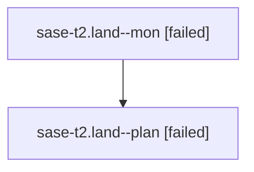

# Family: sase-t2.land

[Agent Hoods](../README.md) / [bbugyi200](../users/bbugyi200/README.md) / [athena](../users/bbugyi200/machines/athena/README.md) / [sase-t2](../users/bbugyi200/machines/athena/hoods/sase-t2/README.md) / sase-t2.land

Owner: `bbugyi200.athena` · Hood: `sase-t2` · Members: 2 · Bead: [sase-t2](https://github.com/sase-org/sase--beads/blob/main/pages/sase-t2/README.md)

## Lineage

The diagram is an optional enhancement; the ordered table below contains the same lineage in accessible text.

| Role | Agent | State | Model / provider | Timing | Commits | Prompt | Chat |
|---|---|---|---|---|---:|---|---|
| mon | sase-t2.land--mon | failed | opus / claude | 2026-08-25T13:44:07.025388+00:00 | 0 | — | [Chat](../agents/bbugyi200.athena.sase-t2.land--mon/chat.md) |
| plan | sase-t2.land--plan | failed | opus / claude | 2026-08-25T12:58:23.837545+00:00 → 2026-08-25T13:44:15.862623+00:00 | 0 | [Prompt](../agents/bbugyi200.athena.sase-t2.land--plan/prompt.md) | [Chat](../agents/bbugyi200.athena.sase-t2.land--plan/chat.md) |

## Neighbors

| Agent | Relation | State |
|---|---|---|
| [sase-t2.1](../agents/bbugyi200.athena.sase-t2.1/README.md) | sase-t2 hood | dismissed |
| [sase-t2.2](../agents/bbugyi200.athena.sase-t2.2/README.md) | sase-t2 hood | dismissed |
| [sase-t2.3](../agents/bbugyi200.athena.sase-t2.3/README.md) | sase-t2 hood | dismissed |
| [sase-t2.4](../agents/bbugyi200.athena.sase-t2.4/README.md) | sase-t2 hood | completed |
| [sase-t2.5](../agents/bbugyi200.athena.sase-t2.5/README.md) | sase-t2 hood | completed |
| [sase-t2.6](../agents/bbugyi200.athena.sase-t2.6/README.md) | sase-t2 hood | completed |
| [sase-t2.7.1](../agents/bbugyi200.athena.sase-t2.7.1/README.md) | sase-t2 hood | completed |
| [sase-t2.7.2](bbugyi200.athena.sase-t2.7.2.md) (family · 2) | sase-t2 hood | active 2 |
| [sase-t2.7.land](../agents/bbugyi200.athena.sase-t2.7.land/README.md) | sase-t2 hood | waiting |
