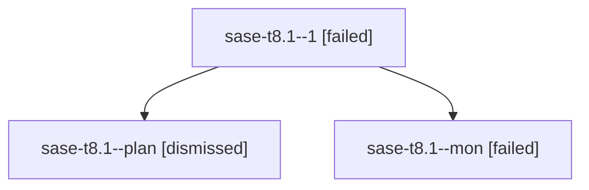

# Family: sase-t8.1

[Agent Hoods](../README.md) / [bbugyi200](../users/bbugyi200/README.md) / [athena](../users/bbugyi200/machines/athena/README.md) / [sase-t8](../users/bbugyi200/machines/athena/hoods/sase-t8/README.md) / sase-t8.1

Owner: `bbugyi200.athena` · Hood: `sase-t8` · Members: 3 · Bead: [sase-t8.1](https://github.com/sase-org/sase--beads/blob/main/pages/sase-t8/sase-t8.1.md)

## Lineage

The diagram is an optional enhancement; the ordered table below contains the same lineage in accessible text.

| Role | Agent | State | Model / provider | Timing | Commits | Prompt | Chat |
|---|---|---|---|---|---:|---|---|
| 1 | sase-t8.1--1 | failed | sonnet / claude | 20260824191559 → 2026-08-24T23:16:43.730282+00:00 | 0 | [Prompt](../agents/bbugyi200.athena.sase-t8.1--1/prompt.md) | — |
| plan | sase-t8.1--plan | dismissed | — | 2026-08-24T18:29:23 | 0 | — | — |
| mon | sase-t8.1--mon | failed | sonnet / claude | 2026-08-24T23:04:27.348531+00:00 | 0 | — | [Chat](../agents/bbugyi200.athena.sase-t8.1--mon/chat.md) |

## Neighbors

| Agent | Relation | State |
|---|---|---|
| [sase-t8.2](../agents/bbugyi200.athena.sase-t8.2/README.md) | sase-t8 hood | completed |
| [sase-t8.3](bbugyi200.athena.sase-t8.3.md) (family · 3) | sase-t8 hood | active 1, completed 1, failed 1 |
| [sase-t8.land](../agents/bbugyi200.athena.sase-t8.land/README.md) | sase-t8 hood | waiting |
